# IP3R Structural Simulator

An interactive 3-D model of the **IP3 receptor** — the endoplasmic
reticulum's IP3- and Ca²⁺-gated Ca²⁺-release channel — driven by models with
a citable basis rather than by animation, and an instrument that
**illustrates, demonstrates and independently re-derives the results of the
[`ip3r_genes`](https://github.com/gddickinson/ip3r_genes) publication
project**. It is the IP3R counterpart of the
[PIEZO1 simulator](https://github.com/gddickinson/piezo1-simulator), whose
renderer, reader and conventions it reuses.

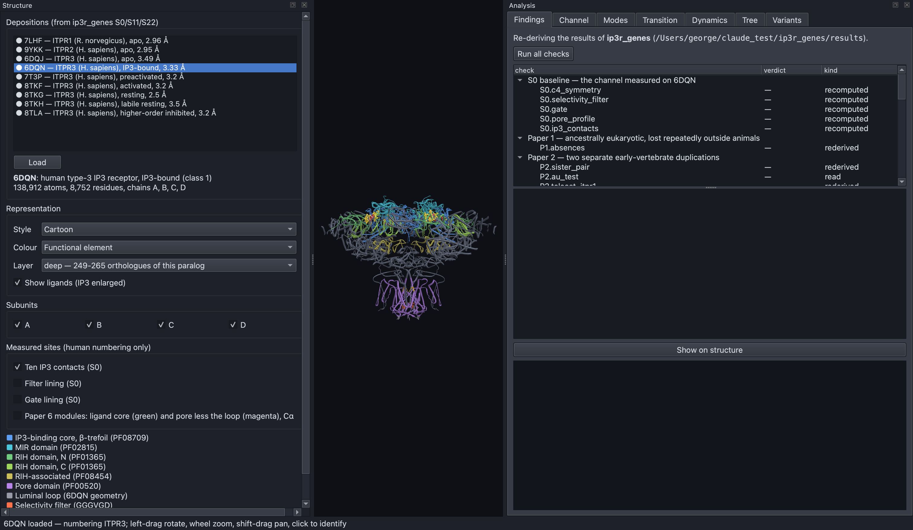

*Human ITPR3 with IP3 bound (PDB 6DQN), cytosolic cap up. Blue/cyan/green:
the IP3-binding β-trefoil, MIR and RIH domains; violet: the pore domain;
gold spheres: the ten residues within 4.5 Å of IP3 at each of the four
sites.*

## What it does

**See the channel.** Nine curated depositions — every ITPR reference and
gating-state structure `ip3r_genes` S11 selected, plus 6DQN — drawn as
cartoon, tube, spheres or sticks, coloured by functional element, subunit,
secondary structure, B-factor or **per-residue conservation** (the S17
tables, four layers, on a fixed scale with unscored residues grey). Residue
annotation is painted only when the deposit is verified to be in that
paralog's human numbering (rat 7LHF is not, and is left grey).

**Measure it.** The four-fold axis is found by superposing each subunit on
its neighbour; the pore profile, the selectivity filter (GGGVGD) and the gate
are located; every bound IP3 is found and its contacts listed.
`python -m ip3r states` measures the whole ITPR3 state panel the same way —
and shows the gating transition at the pore:

| PDB | state | gate radius (Å) |
|---|---|---|
| 8TKH | labile resting | 1.95 |
| 8TLA | higher-order inhibited | 2.44 |
| 7T3P | preactivated | 2.53 |
| 6DQN | IP3-bound | 2.55 |
| 6DQJ | apo | 2.69 |
| 8TKG | resting | 2.73 |
| **8TKF** | **activated** | **5.85** |

**Move it.** An elastic-network model of the tetramer gives its collective
modes, each labelled by its C4 irreducible representation: **A** (all four
subunits alike — the only kind that can couple to IP3 binding at all four
sites and to a symmetric pore opening), **B**, or the degenerate **E** pair.

**Watch it open.** The Transition tab (and `python -m ip3r transition`)
puts two states of one paralog on a residue-matched basis — 2,194 residues
on each of the four subunits of resting 8TKG and activated 8TKF — superposes
them on the pore domain, and morphs between them with peptide Cα–Cα
distances restrained (an interpolation, labelled as one). Side chains are
interpolated too, atom by atom, so the last frame is 8TKF itself and the gate
plotted along the path (2.73 → 5.85 Å, half-way at 0.42) is the gate on
screen; the rigid-side-chain shortcut, drawn dashed, ends 0.7 Å short. Each residue is
coloured by how far it moves, on a fixed 0–25 Å scale: the cytosolic RIH
and MIR domains move 17–22 Å on average, while the pore domain moves 2.5 Å
and the filter 0.8 Å. The tab then asks whether the resting
state's elastic network points towards the activated one. It does: the lowest
collective A mode overlaps the observed displacement at 0.42, where a
random direction of the same symmetry scores 0.02. Twenty modes capture
0.64, against 0.05 at random. The displacement is 100 % A-symmetric, but
that is inherited from C4-imposed reconstruction and is not a finding.

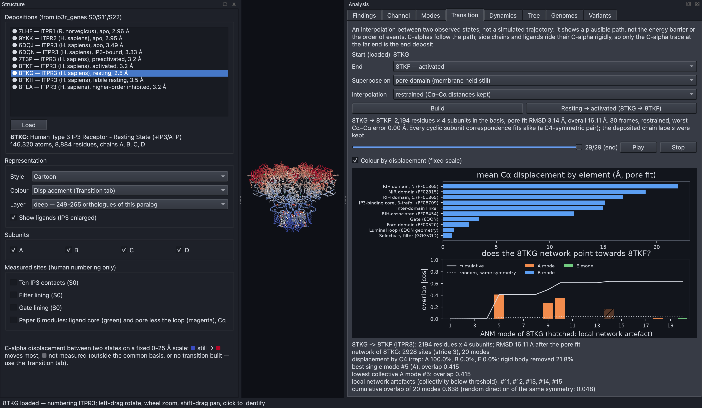

**Gate it.** The De Young–Keizer receptor as reduced by Li & Rinzel: the
bell-shaped Ca²⁺ dependence of open probability, IP3 relieving Ca²⁺
inhibition, whole-cell Ca²⁺ oscillations (measured window 0.36–0.63 µM
IP3), and stochastic clusters in which Ca²⁺ coupling turns independent blips
into cooperative openings. The Gating panel also offers the Hill-type model
Mak, McBride & Foskett (1998) fitted to single IP3R-1 channels, in which IP3
tunes Ca²⁺ inhibition alone. From 33 nM to 10 µM IP3 it moves the
half-inhibition point 6.2× and half-activation 1.016×; De Young–Keizer moves
them 2.8× and 2.0× (`python -m ip3r gating --model mak`).

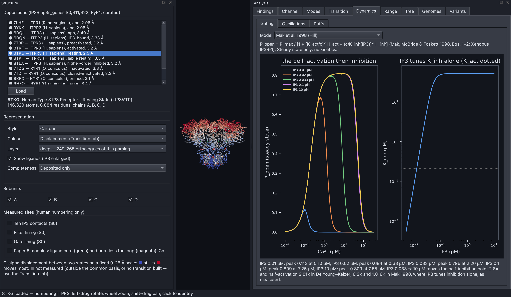

The Puffs panel can fill the same cluster with park/drive receptors
(Siekmann et al. 2012, with the gating variables of Cao et al. 2013; every
constant read from the authors' code). Nearly all of these are parked at
rest, so the cluster stays quiet until one receptor enters drive mode. Then
its Ca²⁺ pulls the others in. Both receptors are measured with one ruler.
Over 30 s at 0.2 µM IP3, the De Young–Keizer cluster reaches half its
channels in at most 1 event at any coupling from 0 to 2 µM per open channel.
The park/drive cluster does so 10–17 times at 0.09–0.32 µM (Fano 2.8, against
≤ 1.32), and its event sizes split into blips and puffs with a valley
between (`python -m ip3r puffs --scan`).

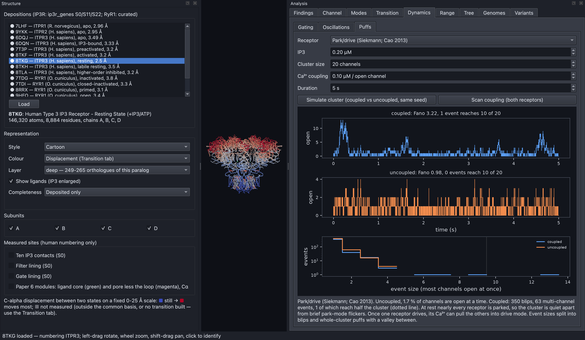

The Channel tab turns each ITPR3 deposit's pore into a K+ conductance by
drift-diffusion (ported from PIEZO1), with and without the charges of the
side chains that line it. Only activated 8TKF conducts. It gives 65 pS
uncharged (25–150 pS over the unmeasured diffusivity and ion radius)
against 358–545 pS measured, so the continuum model falls 2.4× short even
at its most generous. Its own lining charges lower the conductance rather
than raising it. Cancelling the salt-bridged ones (the filter's D2478 is
paired with R2471 of the next subunit) lowers it further, to 23 pS
(`python -m ip3r unitary`).

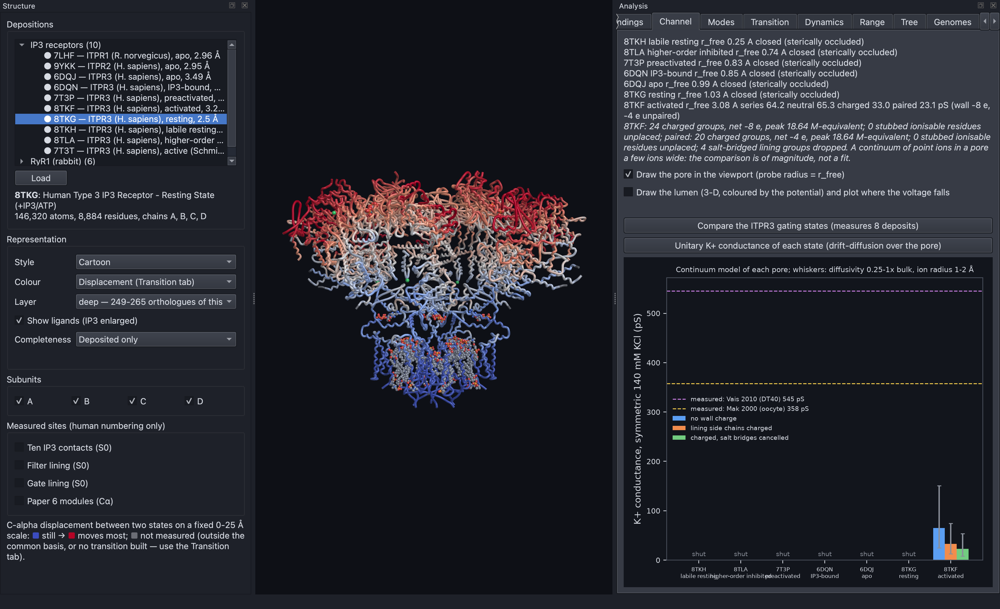

**Ryanodine receptors.** Rabbit RyR1 loads beside the IP3Rs: six deposits
chosen from the PDB by stated rules (`scripts/curate_ryr.py`: full-length,
wild type, activators only, ≤ 4 Å, best per stated state), one each closed,
primed, open, inactivated and closed-inactivated, plus a primed deposit from
the open state's own paper for the morph (9R8O → 9HEO). They go through the
same measurement: every one is in P11716 numbering, the shut states gate at
I4937, and only open 9HEO widens (5.05 Å). Its modelled K+ conductance is
136 pS neutral and 180 pS charged, against 801 pS measured (Xu et al. 2006),
so the continuum model is short on both receptors. RyR1 also allows a
stronger test than one number. Five charge-neutralising mutants were
measured, and the model makes each one on the structure
(`python -m ip3r mutants`). It gets the direction right for all four lining
residues and no effect for E4955Q, which does not line the pore. It misses
the largest effect: D4899Q cuts the conductance to 0.20× but the model
predicts 0.90×. And D4899, like ITPR3's homologous D2478, is salt-bridged,
so cancelling ion pairs predicts no effect at all. The bridge does not
neutralise that charge.

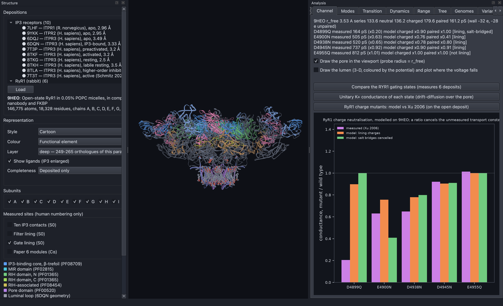

**RyR1 gating and sparks.** Dynamics → Gating → "RyR1" draws Stern et al.
1997's two-gate scheme against Murayama et al. 2015's measured rabbit-RyR1
bell. The scheme activates where RyR1 does (3.9 vs 4.4 µM) but inactivates
6.7× too readily (48 vs 320 µM). Puffs → "RyR1 sparks" runs a 30-channel
cluster with the Ca²⁺ coupling derived from one channel's current at 30 nm.
Uncoupled it gives only blips. Coupled it gives 1.5 sparks per second that
recruit nearly the whole cluster, read with the same ruler as IP3R puffs.
With a single cluster Ca²⁺ the sparks last ~120 ms, against ~6 ms
measured. "RyR1 sparks in the cleft" puts the same channels in Stern's
junctional cleft (two rows, 60 × 15 nm, edges leaking), where each channel
sees its own Ca²⁺ from a steady diffusion solve. Sparks there end by local
inactivation after ~20 ms: six times shorter, still 3× the measurement, and
no geometric uncertainty closes the gap. The Gating tab also draws the
scheme fitted to both measured flanks (dashed: Ka 4.9, Ki 249 µM), and
"RyR1 in the cleft, gating fitted to Murayama 2015" runs it. Once a spark
starts, it never ends. With inactivation made as weak as the measured bell
says, the tens of µM in the cleft cannot shut the array at any
inactivation rate. So what ends a real spark is missing from a Ca²⁺-only
scheme.
Adding the fibre's 1 mM free Mg²⁺ (`spark-mg`; in the GUI, Puffs → Mg²⁺
and "Triggered sparks vs Mg²⁺", and the dash-dot bell in Gating), from open
sources, supplies it. Competing at the activation site, Mg²⁺ shuts every
triggered spark in 17.5–49.5 ms (two readings of its affinity) with no
channel inactivated: the array's feedback falls below one. At the
inhibitory site, Mg²⁺ also holds ~80 % of channels shut before any trigger.

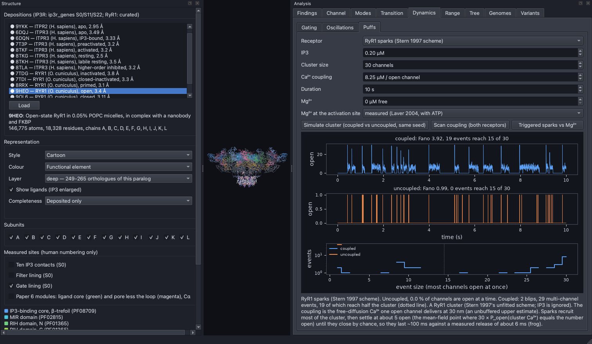
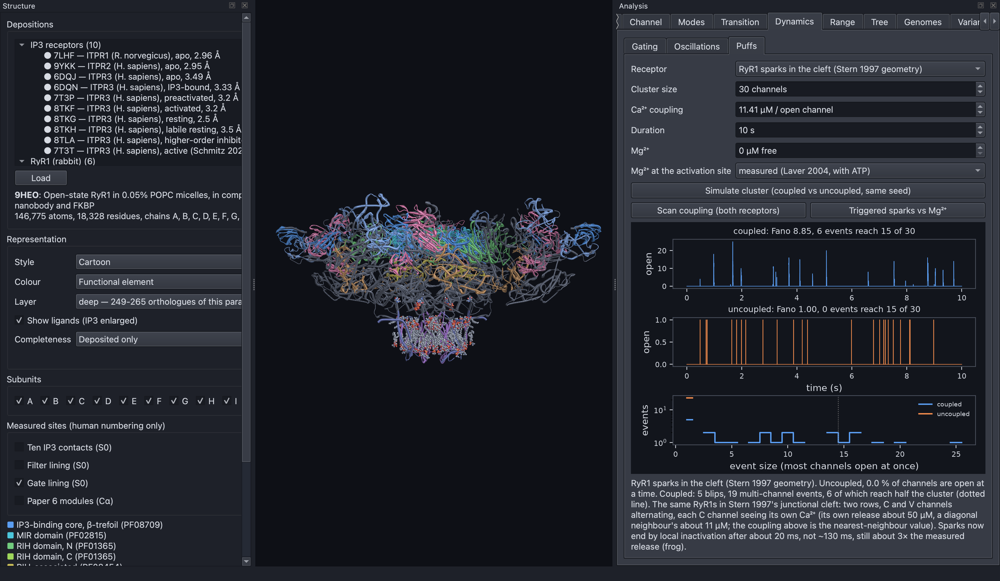
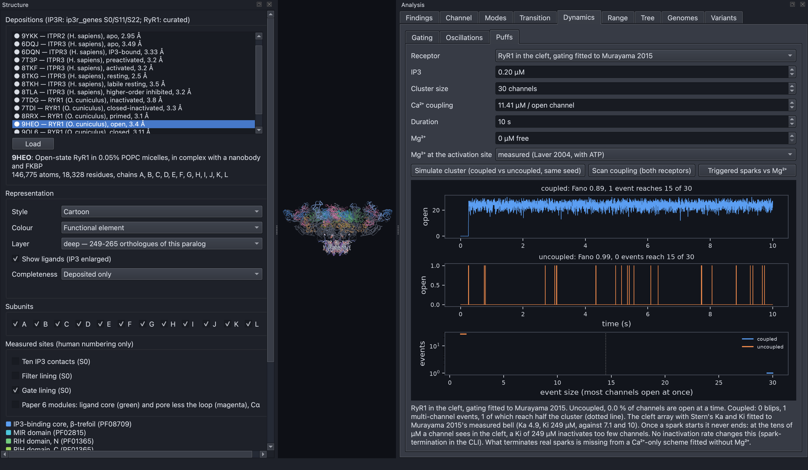
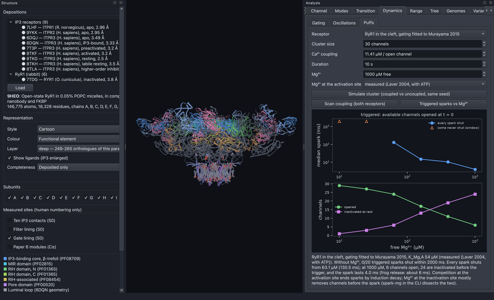

**Check the publication.** The Findings tab re-derives 45 results from the
six `ip3r_genes` papers and its structural baseline, by three routes of
different strength: `recomputed` from coordinates with code the two projects
do not share, `rederived` from the publication's input tables with this
project's arithmetic, and `read` (the table read, the prose tested).

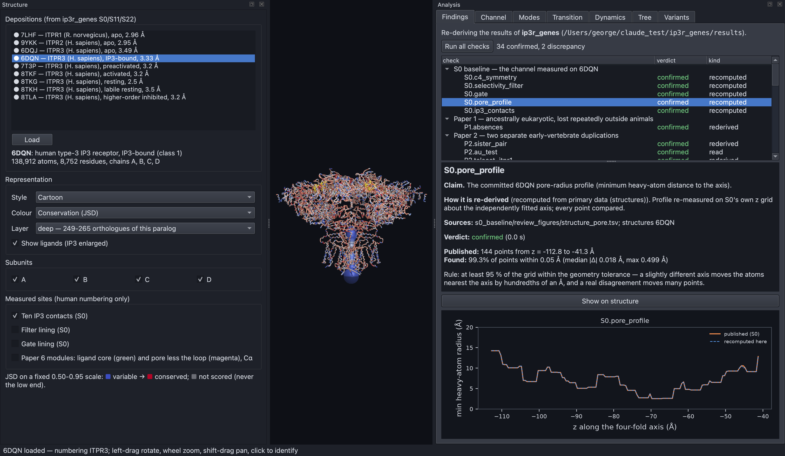

Residue-keyed findings can be drawn on any structure in human numbering.
Paper 6's two modules, for example, are shown as Cα traces: the ligand core
in green and the pore module less the luminal loop in magenta.

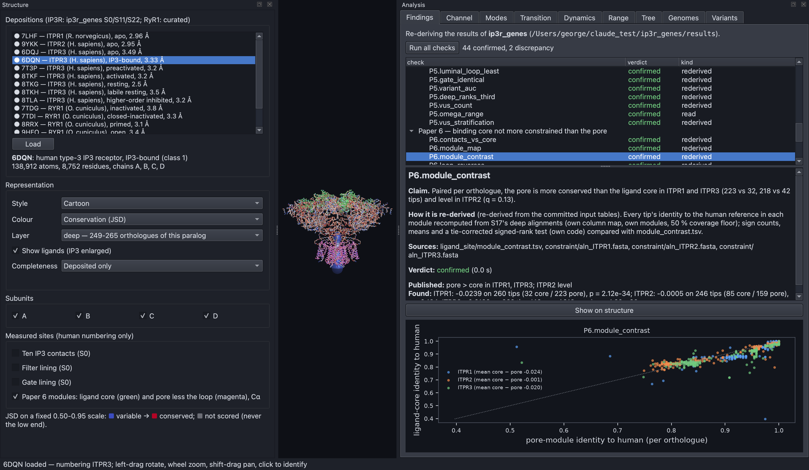

**Colour by distance to IP3.** "Distance to IP3 (S22 shells)" paints every
residue by its all-atom distance to the IP3 bound on its own subunit, in
S22's four shells (contact < 4.5 Å, then 8, 11.5 and 15 Å). Residues beyond
15 Å, and subunits with no IP3, are grey. The shell checks' exhibit plots
conservation against that distance for all three paralogs.

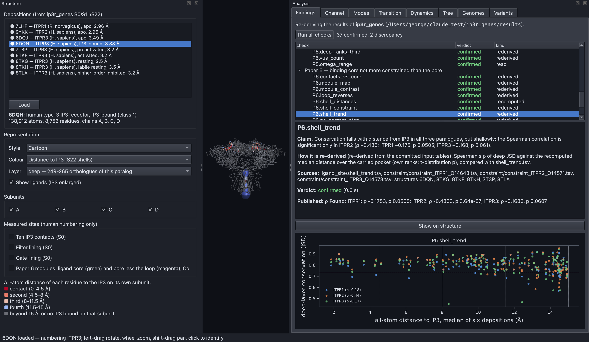

**Read the tree.** The Tree tab draws Paper 2's RyR-rooted maximum-likelihood
tree (134 proteins) from the committed `rooted.nwk`, parsed by this
project's reader. Each paralog's whole clade is boxed with its size and
SH-aLRT/UFBoot support, and so is the RyR outgroup. Hagfish and lamprey tips
are yellow diamonds, labelled with the support of their clade and of the
node where it joins. A white dot marks each node that clears both support
bars (80/95). "Vertebrates" zooms to the 57 vertebrate tips with their
labels. "Show" on any tree check opens this tab.

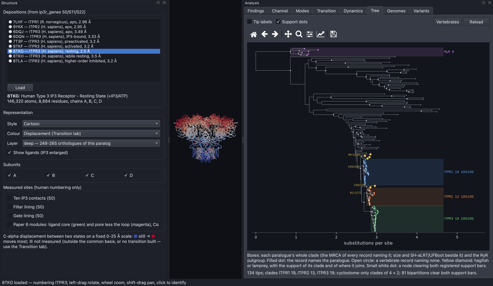

**See every genome.** The Genomes tab draws Papers 3 and 4 as a grid: a row
for each of the 309 assemblies in the retention sweep and a column for each
cell (ITPR1–3 and the RyR control). Each row sits beside a contig-N50 strip
on a fixed log scale. You can colour the cells by what the sweep found, by
the known genes it missed, by the S15a evidence state or by how a protein
search could reach the gene. Rows sort by N50 (the contiguity bar is drawn),
by class, or by name, and can be filtered to a class or to assemblies above
the bar. Clicking a row names the genome and lists its four cells. "Show" on
a P3 or P4 check opens this tab on the right layer.

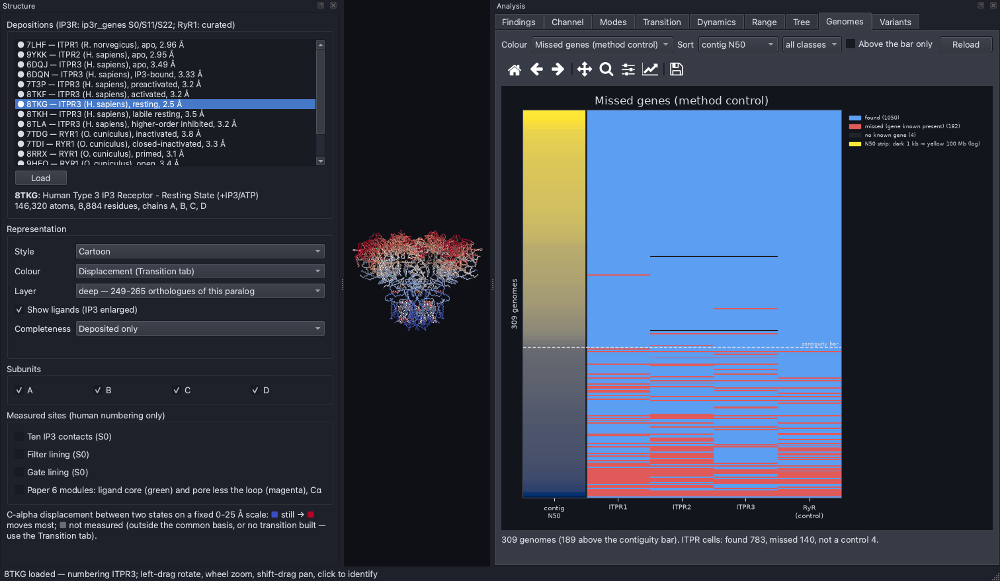

**See where the receptor is.** The Range tab draws Paper 1 as one bar per
clade of the 6,928-proteome sweep. Each bar shows the fraction of swept
proteomes carrying an IP3 receptor call, on a fixed 0–1 scale, coloured by
supergroup; archaea and bacteria are collapsed to one row each. A red cross
marks a clade whose absence held in controlled genome assemblies (a small
one where it held for a class inside the clade). You can hide small clades
or expand the prokaryotes. Clicking a row lists its genome-level absences.
"Show" on any P1 check opens this tab.

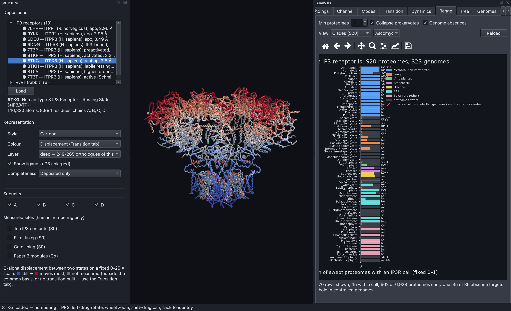

**See the variants, and where the uncertain ones sit.** The Variants tab lists
the S17 harvest for one paralog and class. "Draw on structure" puts a sphere
on every variant residue of that class on all visible subunits: P/LP red,
B/LB blue, conflicting violet, VUS amber. It draws only on a deposit in that
paralog's human numbering; on any other it says why and draws nothing. Choose
a layer under "VUS by layer" and each VUS is placed against its own gene's
labelled medians on that layer, as in Paper 5 §8. A VUS at or above the P/LP
median is *pathogenic-like* (pale red), one at or below the B/LB median is
*benign-like* (pale blue), and an unscored one is grey. The table gains a
stratum column and the plot shows the three classes with both medians. This
is a stratification, not a call.

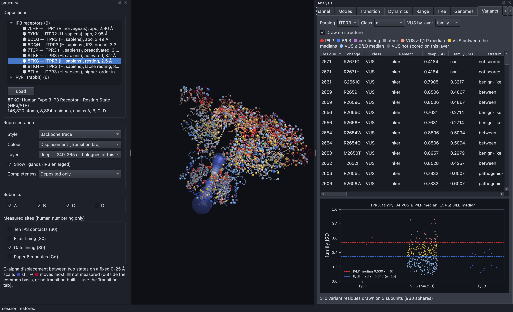

**See what the map leaves out, as a prediction.** Representation →
Completeness adds the AlphaFold model's residues where a deposit has none.
"+ AlphaFold gaps" fills the internal stretches, each fitted on resolved
residues on both sides. "+ gaps and ends" also adds the termini, which have
one side to fit on. The fill is drawn in AlphaFold's own pLDDT colours
whatever the deposit is coloured by. Each seam is a bond from the deposit to
the fill: pale where it closes, red where it does not. The fill follows a
morph or mode frame. It is only drawn: every measurement in the application
still runs on the deposit. The model is chosen by measuring which downloaded
prediction is in the deposit's numbering. AlphaFold DB holds only isoforms
for ITPR1 and ITPR2, so 7LHF and 9YKK are refused and the panel shows why.
On 8TKG, 1,592 residues are filled over the four subunits, at a mean pLDDT
of 38. AlphaFold is least sure exactly where the map is empty. Filling 16
stretches that 8TKG does resolve (but another deposit does not) lands at a
median 1.1 Å, against 5.5 Å for a straight line (`python -m ip3r graft 8TKG --calibrate`).

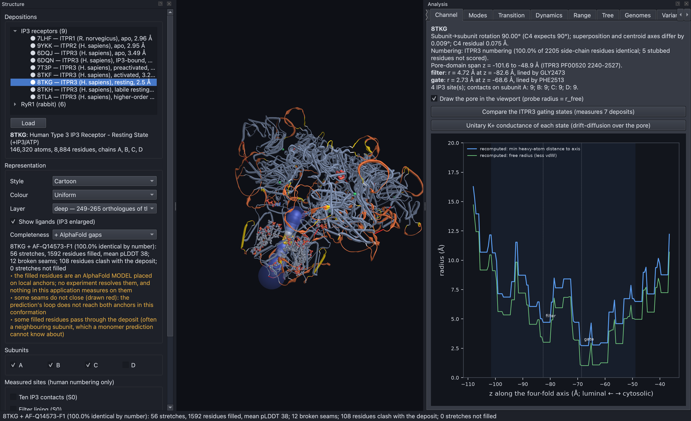

## The checks, as of Round 5

44 confirmed, 2 discrepancies. Both discrepancies are genuine, and neither
touches a published paper's headline:

- **`P6.contacts_heavy_atom`.** S22's positive control — S0's ten IP3 contacts
  recovered in all six IP3-bound depositions — is reproduced exactly with
  S22's rule, which counts hydrogens. Under S0's own heavy-atom definition,
  Arg503 is 4.78 Å (8TKG) and 4.83 Å (8TKH) from IP3, so the control holds
  in 4 of 6 depositions, and in the other two only through a hydrogen.
- **`P5.report_both_metrics`.** The S17 report says the gate and filter are
  the most constrained elements "on both metrics and in all three
  paralogs". On the JSD the ITPR1 top two are RIH-associated and gate, and
  the ITPR2 top two are gate and the β-trefoil. The paper's own Results
  state the narrower, correct version, which `P5.gate_filter_most_conserved`
  confirms.

| check | kind | verdict | re-derived |
|---|---|---|---|
| `S0.c4_symmetry` | recomputed | confirmed | 0.051 Å (S0: 0.058); rotation 90.00°; axes agree to 0.02° |
| `S0.selectivity_filter` | recomputed | confirmed | 5.08 Å (5.06) at −89.8 Å, Asn2472/Gly2473, on GGGVGD |
| `S0.gate` | recomputed | confirmed | 2.55 Å (2.52), Phe2513/Ile2517 |
| `S0.pore_profile` | recomputed | confirmed | 99.3 % of 144 points within 0.05 Å |
| `S0.ip3_contacts` | recomputed | confirmed | the same ten residues at all four sites |
| `P6.shell_agreement` | recomputed | confirmed | all six depositions, counts and extras identical |
| `P6.contacts_heavy_atom` | recomputed | **discrepancy** | R503 outside 4.5 Å by heavy atoms in 8TKG, 8TKH |
| `P5.element_means` | rederived | confirmed | 27 element means, largest Δ 0.0000 |
| `P5.gate_filter_most_conserved` | rederived | confirmed | as the paper states, both metrics |
| `P5.report_both_metrics` | rederived | **discrepancy** | report sentence overstates the JSD ranking |
| `P5.luminal_loop_least` | rederived | confirmed | last in all three |
| `P5.gate_identical` | rederived | confirmed | FGVII in all three |
| `P5.variant_auc` | rederived | confirmed | all AUCs and position counts |
| `P5.deep_ranks_third` | rederived | confirmed | family 0.872 > vert 0.854 > deep 0.758 > shallow 0.684 |
| `P5.vus_count` | rederived | confirmed | 1,546 |
| `P5.vus_stratification` | rederived | confirmed | all 12 gene × layer rows, every count, median and fraction; ClinVar-only gives the same table |
| `P5.omega_range` | read | confirmed | ω 0.024, 0.043, 0.042 |
| `P6.contacts_vs_core` | rederived | confirmed | +0.069, +0.092, +0.073 |
| `P6.module_map` | rederived | confirmed | all nine module spans identical |
| `P6.module_contrast` | rederived | confirmed | core − pore −0.0239 / −0.0005 / −0.0199; ITPR2 p = 0.134 |
| `P6.loop_reverses` | rederived | confirmed | loop counted as pore: +0.055 / +0.044 / +0.056 |
| `P6.shell_distances` | recomputed | confirmed | 125 residues, 12/14/40/59 per shell, medians to 2×10⁻⁵ Å |
| `P6.shell_constraint` | rederived | confirmed | all 12 shell means above the protein; every field identical |
| `P6.shell_trend` | rederived | confirmed | ρ −0.175 / −0.436 / −0.168; significant in ITPR2 only |
| `P6.no_contact_step` | rederived | confirmed | 4.5 Å drop −0.007 / +0.003 / +0.002; largest drop at 11.5 Å in all three |
| `P2.sister_pair` | rederived | confirmed | ITPR2 + ITPR3 |
| `P2.au_test` | read | confirmed | only H3_23 retained (p_AU 0.48) |
| `P2.teleost_itpr1` | rederived | confirmed | ≥ 2 copies: ITPR1 87 %, ITPR2 4 %, ITPR3 2 % |
| `P2.paralog_clades` | rederived | confirmed | 19/13/19 at 100/100, 4/2/1 unnamed; only the 6 cyclostomes outside |
| `P2.cyclostome_lineages` | rederived | confirmed | two cyclostome-only clades, both species in each; 4 first among vertebrates (99.5/100), 2 join ITPR2+ITPR3 (83.1/77) |
| `P2.support_bar` | rederived | confirmed | 91 of 131 bipartitions clear both bars |
| `P3.no_absent_cells` | rederived | confirmed | 927 cells, 0 absent |
| `P3.dollo_zero` | read | confirmed | 0 losses |
| `P3.false_negatives` | rederived | confirmed | 140/923, 5/563 contiguous |
| `P4.unreachable` | rederived | confirmed | 744 / 923 |
| `P3.miss_by_contiguity` | rederived | confirmed | median N50 23,460 vs 3,396,515; chromosome 3/512 and 0/172; above bar 189 genomes, 5/563; below 0.3917/0.4333/0.3000 |
| `P3.contiguity_tests` | rederived | confirmed | all 12 tests: OR per 10× 8.10 / 19.99, ITPR vs RyR Fisher p 0.578 |
| `P4.recovery_channels` | rederived | confirmed | 257/309, 260/307, 227/307, RyR 196/309; reasons 289/186/254/15, 179 reachable |
| `P1.absences` | rederived | confirmed | 35 clades |
| `LEDGER.claims` | read | confirmed | 287 + 245 + 713 ledger rows all ok |

Every check is calibrated: `tests/test_checks_calibration.py` runs each one on
a copy of only the tables it declares, then plants a change and requires the
verdict to flip.

## Installing

```
bash scripts/create_env.sh          # or: conda create -n ip3r_sim --clone piezo1
conda activate ip3r_sim
make fetch                          # nine mmCIF files, ~27 MB, into ref/
```

Clone `ip3r_genes` beside this repository (or set `IP3R_GENES_DIR`) for the
findings checks; everything else runs without it.

## Running

```
./run_app.command                   # the GUI (activates ip3r_sim; double-click in Finder)
python -m ip3r                      # the GUI, from an activated environment
python -m ip3r --session view.json  # the GUI, reopened on a saved session
python -m ip3r checks [--paper constraint] [--figures out/]
python -m ip3r states               # the ITPR3 gating states at the pore
python -m ip3r unitary              # their K+ conductance, vs 358/545 pS
python -m ip3r states --paralog RYR1   # the curated RyR1 states (also unitary)
python -m ip3r mutants              # RyR1 charge mutants: model vs Xu 2006
python -m ip3r transition 9R8O 9HEO # RyR1 primed -> open
python -m ip3r ryr-gating | sparks --scan   # RyR1 bells; sparks over the coupling band
python -m ip3r sparks --cleft      # sparks with each channel's own Ca2+ in the cleft
python -m ip3r sparks --cleft --fit  # the same with Ka, Ki fitted to Murayama's bell
python -m ip3r spark-termination --scan fit|ki|rate  # what ends a cleft spark
python -m ip3r spark-mg [--scan] [--ratio]  # Mg2+ ends a triggered spark
python -m ip3r info 8TKF            # one deposit, measured
python -m ip3r modes 6DQN           # normal modes with C4 irreps
python -m ip3r transition 8TKG 8TKF # morph, displacement, mode overlap (--gate: pore per frame)
python -m ip3r graft 8TKG --calibrate   # AlphaFold fills, seams, and how good they are
python -m ip3r gating | oscillate --window | puffs --ip3 0.2
python -m ip3r puffs --model park-drive | puffs --scan   # the two receptors
make help
```

Mouse: left-drag rotate, shift-drag pan, wheel zoom, click to identify a
residue (element and conservation shown). `Ctrl+1` side view, `Ctrl+2` down
the pore, `Space` spin.

**Changing a parameter.** Help → Parameters… (`Ctrl+Shift+P`) lists every
registered number with its default, bounds and source; double-click a value
to change it (out-of-range values are clamped, and the clamp is reported).
While anything differs from its default an amber banner runs across the top
of the window, and the findings checks report *not run* rather than confirm.
Nothing typed is remembered after you quit. "Export…" writes the set as
JSON, which `IP3R_PARAMETERS=file.json python -m ip3r …` reproduces headless.

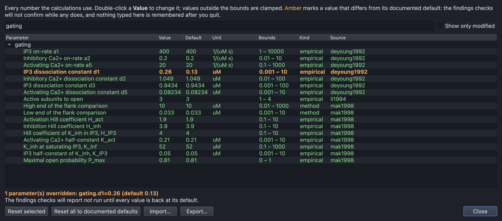

**Saving where you were.** File → Save session… (`Ctrl+Shift+S`) writes the
view as JSON: the deposit, style, colouring, layer, subunits, marked sites,
pore, camera, open tab, and any transition built (end, fit, method, frame).
File → Open session… (`Ctrl+O`) or `--session` puts it back. A session holds
no coordinates and no results: it is re-derived from the same inputs on
opening. It does record the parameter overrides in force when it was saved.
If they differ from the current set, you are asked whether to apply them
(the deposit is then re-measured) or keep your own.

## How it is built, and how it checks itself

See [`INTERFACE.md`](INTERFACE.md) for the module map and
[`docs/SCIENCE.md`](docs/SCIENCE.md) for the models (the ryanodine
receptor in [`docs/SCIENCE_RYR.md`](docs/SCIENCE_RYR.md)). Every number a
calculation uses is a registered parameter with a unit, bounds and a source
(`python -m ip3r params`); curated data imported from `ip3r_genes` records
the SHA-256 of its source tables (`make sync-check`). Files stay under 500
lines. What is next is in [`ROADMAP.md`](ROADMAP.md).

## References

De Young & Keizer 1992 (PNAS 89:9895); Li & Rinzel 1994 (J Theor Biol
166:461); Bezprozvanny, Watras & Ehrlich 1991 (Nature 351:751); Mak, McBride
& Foskett 1998 (PNAS 95:15821); Swillens et al. 1999 (PNAS 96:13750); Shuai &
Jung 2002 (Biophys J 83:87); Siekmann et al. 2012 (Biophys J 103:658); Cao et
al. 2013 (Biophys J 105:1133); Cao et al. 2014 (PLoS Comput Biol
10:e1003783); Smith & Parker 2009 (PNAS 106:6404); Paknejad &
Hite 2018 (NSMB 25:660); Atilgan et al. 2001 (Biophys J 80:505); Yang, Song &
Jernigan 2009 (PNAS 106:12347); Tama & Sanejouand 2001 (Protein Eng 14:1);
Brüschweiler 1995 (J Chem Phys 102:3396); Kabsch 1976 (Acta Cryst A32:922); Hanley &
McNeil 1982 (Radiology 143:29); Barlow & Thornton 1983 (J Mol Biol
168:867); Xu et al. 2006 (Biophys J 90:443); Stern, Pizarro & Ríos 1997
(J Gen Physiol 110:415); Murayama et al. 2015 (PLoS One 10:e0130606); Ríos
et al. 1999 (J Gen Physiol 114:31). Full entries: `ip3r/resources/references.json`.
