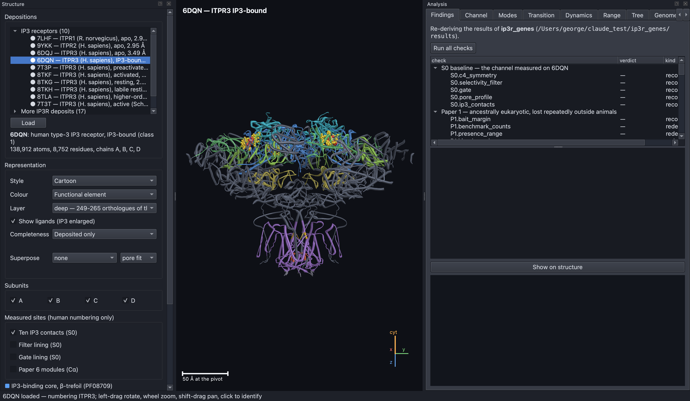
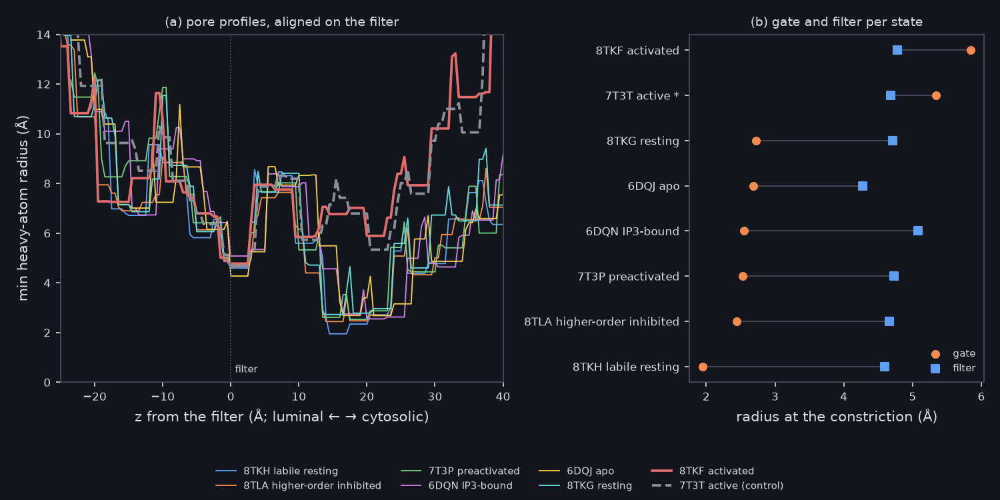
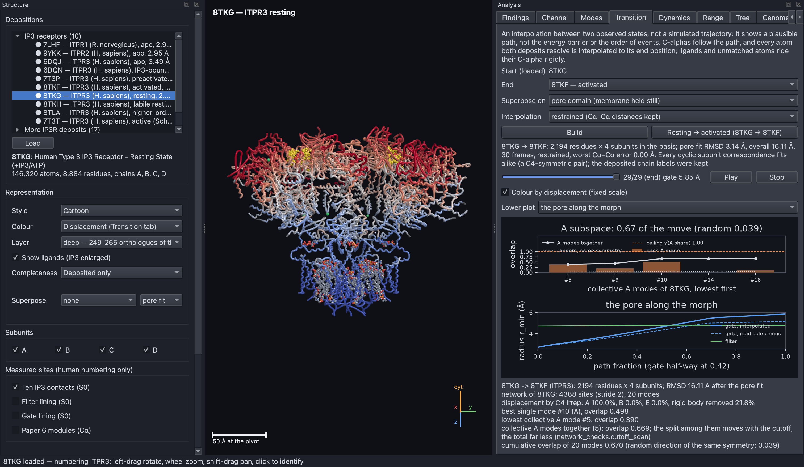
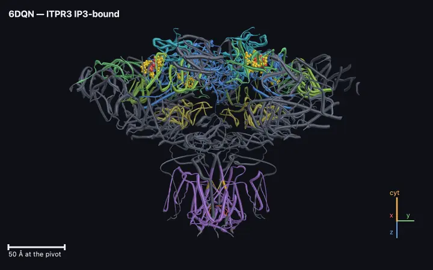
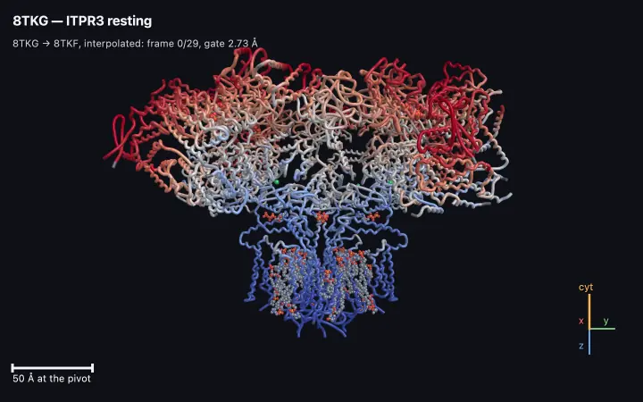
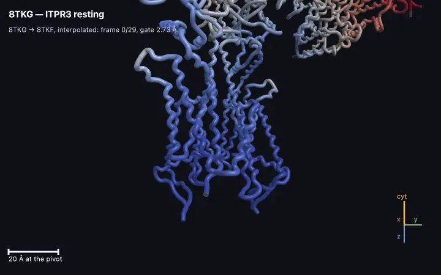
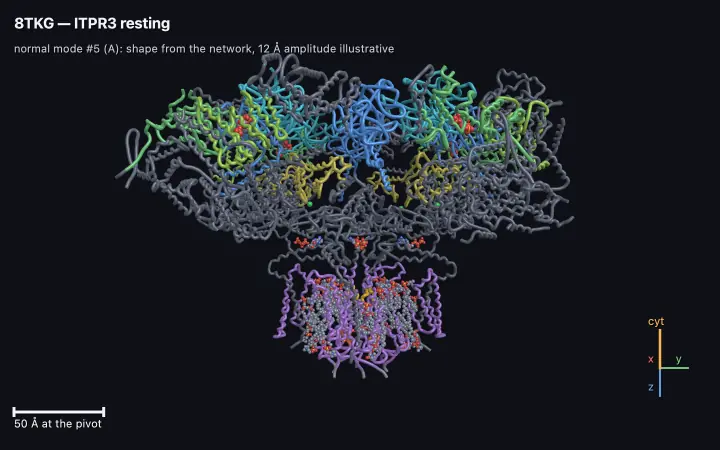
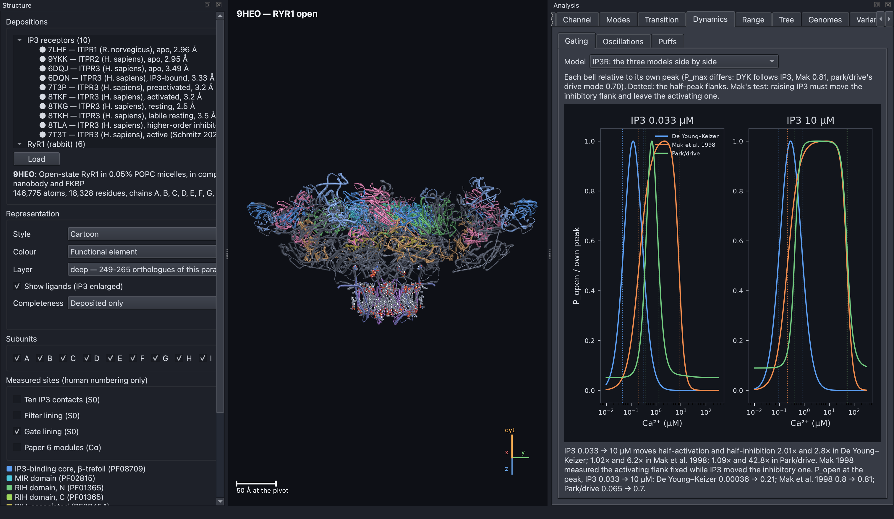
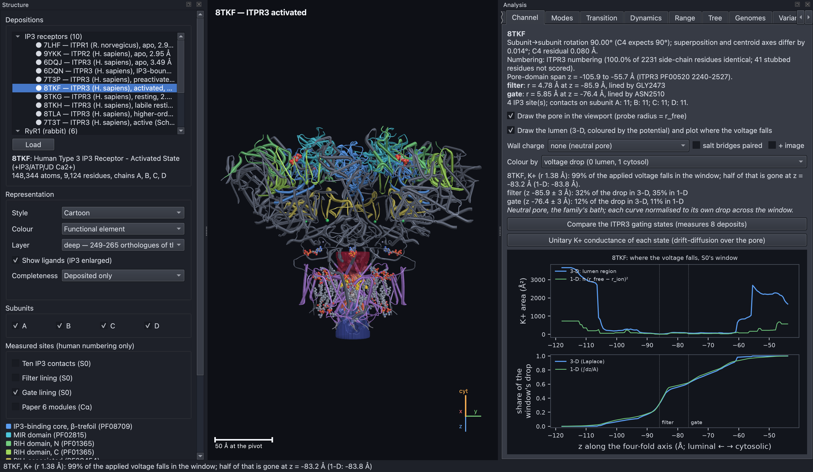
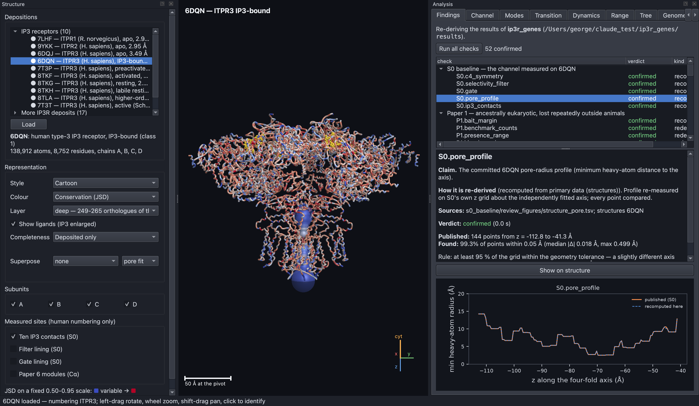

# IP3R Structural Simulator

An interactive, physics-based 3-D model of the **inositol 1,4,5-trisphosphate
receptor (IP3R)**, the channel that releases calcium from the cell's internal
store. It is also an independent checking instrument for the
[`ip3r_genes`](https://github.com/gddickinson/ip3r_genes) publication
project: it re-derives that project's published results from their original
inputs and shows them on the receptor's structure.

The simulator loads experimentally determined structures of the receptor,
measures them, moves them, and runs models of how the channel opens, how
ions pass through it and how clusters of channels produce calcium signals.
Every number a calculation uses is a registered, cited parameter, so each
result can be traced to its source. Numbers in square brackets, such as [3],
refer to the [reference list](#the-references-cited-in-this-readme-are-listed-here) at the end.

<p align="center">
  
</p>

**Figure 1. The main window shows human IP3 receptor type 3 (PDB 6DQN) with
IP3 bound.** The left panel chooses the structure and how it is drawn, the
centre is the 3-D view, and the right panel holds the analysis tabs. The
receptor is drawn side-on with the cytosolic side at the top and the
membrane-embedded pore at the bottom. The colours mark functional regions:
blue, cyan and green for the IP3-binding β-trefoil, MIR and RIH domains at
the top, and violet for the pore domain at the bottom. The gold spheres are
the ten amino acids that touch each bound IP3 molecule, one site on each of
the four subunits. The scale bar and the axis marker ("cyt" points to the
cytosol) sit in the corner of the 3-D view.

## The contents list links to each section below.

1. [This section explains the biology behind the project.](#this-section-explains-the-biology-behind-the-project)
2. [The simulator lets you see, measure, move and test the receptor.](#the-simulator-lets-you-see-measure-move-and-test-the-receptor)
3. [The models have produced several findings so far.](#the-models-have-produced-several-findings-so-far)
4. [You can install the simulator with conda in a few steps.](#you-can-install-the-simulator-with-conda-in-a-few-steps)
5. [You can run the simulator as a desktop app or from the command line.](#you-can-run-the-simulator-as-a-desktop-app-or-from-the-command-line)
6. [The repository is organised into layers, and every module is mapped.](#the-repository-is-organised-into-layers-and-every-module-is-mapped)
7. [Licence and citation are described here.](#licence-and-citation-are-described-here)
8. [The references cited in this README are listed here.](#the-references-cited-in-this-readme-are-listed-here)

## This section explains the biology behind the project.

### Calcium is one of the cell's most widely used signals.

Almost every cell uses short rises in calcium concentration to switch
processes on: muscle contraction, hormone and neurotransmitter release,
fertilisation, gene expression and cell death [1, 2]. At rest the calcium
level in the cytosol (the fluid inside the cell) is kept very low, about 0.1
micromolar (µM). Much higher levels are stored inside the endoplasmic
reticulum (ER), a membrane-bound compartment that acts as the cell's calcium
store. A signal is produced when channels in the ER membrane open and let
calcium flow out into the cytosol.

### The IP3 receptor is the main channel that releases calcium from the store.

When a hormone or neurotransmitter binds to the cell surface, the cell makes
a small messenger molecule called **IP3** (inositol 1,4,5-trisphosphate).
IP3 diffuses to the ER and binds to the IP3 receptor [3]. The receptor also
senses calcium itself. A little cytosolic calcium helps it open, while a lot
shuts it again, so the chance that the channel is open rises and then falls
with calcium in a bell-shaped curve [4]. That self-reinforcing then
self-limiting behaviour lets one open channel trigger its neighbours. The
result is local bursts of release called **puffs** [5], and at higher IP3
levels, waves and repeating oscillations that sweep across the whole cell.

Humans have three versions (paralogs) of the receptor, encoded by the genes
**ITPR1**, **ITPR2** and **ITPR3**. Each receptor is built from four
identical subunits of about 2,700 amino acids each. The four subunits are
arranged around a central four-fold axis (C4 symmetry), and the axis runs
through the ion-conducting pore. Each subunit has three main parts:

- an **IP3-binding core** at the cytosolic end, where IP3 binds about 70 Å
  from the pore axis;
- large **regulatory domains** (the MIR and RIH domains) that pass the
  binding signal down to the pore;
- a **pore domain** in the membrane. Its **selectivity filter** (the amino
  acid sequence GGGVGD) faces the ER lumen and helps decide which ions pass.
  Its **gate** is a ring of side chains near the cytosolic side that blocks
  the pore when the channel is shut.

### Cryo-electron microscopy has captured the receptor in several states.

Cryo-electron microscopy (cryo-EM) produces atomic models of large proteins,
which are deposited in the Protein Data Bank (PDB) under four-character
codes such as 6DQN [6]. For human ITPR3 there are models of the receptor with
no ligand and with IP3 bound [7], in preactivated and active forms [8], and in
resting, inhibited and activated, open forms (8TKF) [9]. Comparing these
states shows how the protein changes shape when it opens. The simulator
measures all of them the same way.

### The ip3r_genes project made claims that this simulator re-derives.

[`ip3r_genes`](https://github.com/gddickinson/ip3r_genes) is a series of six
papers about the receptor family. The papers cover where in the tree of life
the receptor is found, how the three paralogs evolved, where the gene has
been lost, which parts of the protein are most conserved, how disease
variants are distributed, and how the ligand-binding and pore regions
differ. This simulator does not share code with that project. It reads the
same input tables and structures and recomputes the published numbers by its
own route. When the two disagree, the simulator's checker is suspected
first. Genuine disagreements are reported back to the publication project,
which has corrected both of the two found so far.

### The ryanodine receptor is used as a control.

The **ryanodine receptor (RyR)** is the IP3 receptor's larger relative. It
releases calcium in muscle and has been studied more thoroughly: its open
pore's conductance, the effects of charge-changing mutations [10], and its
calcium "sparks" have all been measured in detail. The simulator runs the
same models on rabbit RyR1, including an open structure [11]. If a model
fails on RyR1 as well, the failure lies in the model rather than in the IP3
receptor structure.

### A short glossary explains the terms used throughout.

| Term | Meaning |
|---|---|
| **Deposit** | One atomic model in the PDB, named by its code (for example 8TKF). |
| **Paralog** | One of the three human receptor genes, ITPR1, ITPR2 or ITPR3. |
| **Lumen** | The inside of the ER, which holds the calcium store. The pore's luminal end faces it. |
| **Pore profile** | The pore's radius measured at each height along the four-fold axis. |
| **Conductance** | How easily ions flow through one open channel, in picosiemens (pS). |
| **P_Ca:P_K** | How much more readily the channel passes calcium than potassium. The measured value for IP3R is 15.2. |
| **Elastic network model** | A model that treats the protein as beads joined by springs, used to find its natural large-scale motions ("modes"). |
| **A, B, E modes** | Motions classified by symmetry. In an A mode all four subunits move alike, which is the only kind that can open a four-fold pore symmetrically. |
| **Puff / spark** | A local burst of calcium release from a cluster of IP3 receptors (puff) or ryanodine receptors (spark). |
| **JSD conservation** | A per-residue score of how little an amino acid position varies across species. A higher score means the position is more conserved. |
| **VUS** | A "variant of uncertain significance": a human DNA change that has not been classified as harmful or harmless. |

## The simulator lets you see, measure, move and test the receptor.

### The viewer draws each structure and colours it by what is known about it.

The viewer draws the nine curated IP3R structures that the publication uses,
one control structure (7T3T), 17 further full-length IP3R structures and six
RyR1 structures. Each can be shown as a cartoon, tube, spheres or sticks,
and coloured by functional region, subunit, secondary structure, B-factor,
conservation, distance to IP3, or disease variant. Information tied to
residue numbers is only painted when the simulator has confirmed that the
structure uses the same human numbering; the rat structure 7LHF does not, so
it is shown grey rather than guessed. You can select residues, measure
distances, read the sequence, superpose two states, fill unresolved parts of
a structure from an AlphaFold prediction [12, 13], and record movies.

### Measuring the pore shows that only the activated structure is open.

The simulator finds the four-fold axis by superposing each subunit onto its
neighbour [14]. It then measures the pore radius along the axis, locates the
filter and the gate, and lists every contact with bound IP3. Applied to every
ITPR3 structure, it shows the opening at the gate:

| PDB | State | Gate radius (Å) |
|---|---|---|
| 8TKH | labile resting | 1.95 |
| 8TLA | higher-order inhibited | 2.44 |
| 7T3P | preactivated | 2.53 |
| 6DQN | IP3-bound | 2.55 |
| 6DQJ | apo (no ligand) | 2.69 |
| 8TKG | resting | 2.73 |
| **8TKF** | **activated** | **5.85** |

The 11 other full-length ITPR3 structures in the PDB are all shut (gate
radius 1.57–2.59 Å). So 8TKF and the independent control 7T3T are the only
open IP3R pores that have been deposited.



**Figure 2. The gate widens only in the activated structures.** Panel (a)
overlays the pore radius of every ITPR3 state, aligned so that the selectivity
filter sits at zero. The lumen is to the left and the cytosol to the right.
All states share the same narrow filter at zero, but only activated 8TKF
(thick red) and the control 7T3T (dashed grey) stay wide through the gate
region 10–20 Å cytosolic of it. Panel (b) plots the radius at the gate
(orange) and at the filter (blue) for each state. The filter barely changes,
while the gate more than doubles in the active states.

### The morph shows how the receptor moves from resting to open.

The Transition tab matches the same 2,194 residues on each of the four
subunits of resting 8TKG and activated 8TKF [9]. It aligns the two structures
on their pore domain and interpolates between them, keeping neighbouring
backbone atoms at their correct spacing. The result is a plausible path, not
a simulated trajectory. The large cytosolic domains move 17–22 Å on average,
while the pore domain moves about 2.5 Å. The tab then asks whether the
resting structure's natural motions, from an elastic network model [15],
point towards the open state [16]. They do: the symmetric A motions together
account for 0.67 of the observed movement, whereas a random direction with
the same symmetry accounts for 0.04. No single mode explains it on its own.



**Figure 3. The resting structure's natural motions point towards the open
state.** The structure is 8TKG coloured by how far each residue moves on the
way to 8TKF, on a fixed 0–25 Å scale from blue (still) to red (moves most).
The cytosolic cap moves most and the membrane pore least. The upper plot
adds the symmetric A modes one at a time, lowest first: together they
capture 0.67 of the movement (white line), far above the 0.04 expected by
chance (dotted line). The lower plot follows the gate radius along the path,
from 2.73 to 5.85 Å. It is halfway open at 0.42 of the way along. The dashed
line shows that keeping side chains rigid would leave the gate 0.7 Å short.

### Movies show the receptor turning, opening and flexing.

These movies were recorded with File → Record movie… (see
[below](#you-can-record-movies-of-the-3-d-view)) by the scripted test of the
app, which also checks every frame. They are animated WebP files, which play
in every current browser.

<table>
<tr>
<td width="50%" valign="top"><br>
<b>Movie 1. The IP3-bound receptor turns once about its four-fold axis.</b>
6DQN is coloured by functional region as in Figure 1, with the IP3 contacts
in gold. Because the four subunits are identical, the view repeats every
quarter turn.</td>
<td width="50%" valign="top"><br>
<b>Movie 2. The receptor morphs from resting (8TKG) to activated (8TKF) and
back.</b> Colours show how far each residue moves (blue still, red most).
The cytosolic cap swings and twists while the membrane region hardly moves.
The HUD line gives the frame and the gate radius, 2.73 → 5.85 Å.</td>
</tr>
<tr>
<td valign="top"><br>
<b>Movie 3. Close to the pore, the gate opens while the filter stays put.</b>
The same morph with two opposite subunits and all ligands hidden, framed on
the pore domain (scale bar 20 Å). The pore-lining helices move apart at the
gate, while the luminal end at the bottom barely changes.</td>
<td valign="top"><br>
<b>Movie 4. The resting receptor's softest symmetric motion flexes the
whole tetramer.</b> One cycle of 8TKG's lowest collective A mode (#5), in
which all four subunits move alike. Its shape comes from the elastic network
model; its amplitude and speed are illustrative.</td>
</tr>
</table>

Movies 2 and 3 interpolate between two measured structures; they show a
plausible path, not the order or timing of real events.

### The gating models reproduce the receptor's bell-shaped calcium response.

The Dynamics tab runs three published models of how calcium and IP3 control
opening: the De Young–Keizer model [17] as simplified by Li and Rinzel [18],
the model Mak, McBride and Foskett fitted to single channels [19], and the
park/drive model of Siekmann and Cao [20, 21]. The same tab simulates
whole-cell calcium oscillations and stochastic clusters of channels, in
which calcium coupling turns single openings into puffs.



**Figure 4. Three published gating models are compared on one set of
axes.** Each curve is the probability that a channel is open (vertical)
against cytosolic calcium on a log scale (horizontal), at a low (33 nM) and
a high (10 µM) IP3 concentration. Each curve is scaled to its own peak so
that the shapes can be compared. In the measurements, raising IP3 mainly
shifts the point where high calcium shuts the channel (the right-hand side of
the bell) [19]. The Mak and park/drive models reproduce this; De Young–Keizer
also moves the left-hand side.

### The permeation models turn each pore's shape into a predicted current.

The Channel tab and several command-line analyses estimate how fast ions flow
through each open pore. They start from a one-dimensional drift-diffusion
model and go on to three-dimensional solutions in the real shape of the
lumen. The models include the charges on the pore wall, the image force from
the low-permittivity protein, ion size and crowding [22, 23], and the
bi-ionic experiments used to measure selectivity [24]. The results are
summarised [below](#the-models-have-produced-several-findings-so-far), and the
full account, with every figure, is in [`docs/RESULTS.md`](docs/RESULTS.md).



**Figure 5. The simulator draws the open pore's lumen and shows where the
voltage falls.** The coloured surface inside activated 8TKF is the space
available to a potassium ion, coloured by the electric potential from the
lumen (blue) to the cytosol (red). The upper plot compares the lumen's
cross-sectional area in 3-D (blue) with the simpler 1-D model (green), which
keeps only the largest inscribed circle. The lower plot shows how much of the
applied voltage has been dropped at each height. The two models agree on
where the voltage falls: 32 % across the filter in 3-D and 35 % in 1-D.

### The Findings tab re-derives 52 results from the publication.

The Findings tab runs 52 checks against the `ip3r_genes` papers and their
structural baseline. Each check is labelled by how independent it is:
**recomputed** (9 checks) are measured again from the atomic coordinates with
code the two projects do not share; **rederived** (39) are computed again from
the publication's input tables with this project's own arithmetic; and
**read** (4) read the publication's table and test its prose against it. All
52 are confirmed as of `ip3r_genes` supplement S29. Every check is
calibrated: a test plants a change in one of its input tables and requires
the verdict to flip ([`docs/SCIENCE_CHECKS.md`](docs/SCIENCE_CHECKS.md)).
Further tabs draw the publication's evolutionary tree, its genome survey, the
receptor's range across the tree of life and the human variants; they are
described with figures in [`docs/USER_GUIDE.md`](docs/USER_GUIDE.md).



**Figure 6. Each finding shows the claim, the method, the verdict and a
plot.** The list at the top groups the checks by paper, each with its
verdict (green means confirmed) and kind. The selected check,
`S0.pore_profile`, compares the published pore radius of 6DQN with the one
measured here. The text states the claim, how it was re-derived, the source
files, and the rule for agreement. The plot below overlays the published
profile (orange) and the recomputed one (dashed blue). They coincide, with
99.3 % of points within 0.05 Å.

## The models have produced several findings so far.

These are the main results. The evidence behind each, and the figures, are in
[`docs/RESULTS.md`](docs/RESULTS.md) and
[`docs/RESULTS_DYNAMICS.md`](docs/RESULTS_DYNAMICS.md).

1. **Only the activated structure conducts, and it conducts too little.** The
   simple model predicts 65 pS for 8TKF, against 358–545 pS measured [25, 24].
   Solving in the lumen's real 3-D shape raises the prediction 1.3–2.0×. The
   same method gives RyR1's measured conductance almost exactly (787 against
   801 pS [10]), so the remaining IP3R shortfall is real.
2. **The charged wall alone cannot explain calcium selectivity.** No reading
   of the wall's charges, protonation states, electrostatic treatments, image
   forces or ion crowding lifts P_Ca:P_K above about 2, against 15.2 measured
   [24]. RyR1 fails in the same way, which points to the model's treatment of
   ions rather than to the IP3R structure.
3. **The gate's shape and the measuring protocol are not the problem.**
   Widening the gate by up to 4 Å moves P_Ca:P_K by less than 20 %, and
   simulating the full bi-ionic reversal experiment moves it by 15 % or less.
4. **A mathematical bound rules out every smooth potential.** For point ions
   passing in single file, the product of the two measured ratios cannot
   exceed 1 relative to an uncharged pore. The measured pair needs about 3,200.
5. **A calcium-binding site that blocks potassium reproduces both measured
   ratios.** A saturable calcium site spanning the pore, compensated by fixed
   charge and blocking K⁺ when occupied, reaches 15.2 at a binding energy of
   about 4 kT (dissociation constant 3–6 mM). This is the
   "anomalous mole-fraction" mechanism known from calcium channels.
6. **That site makes a testable prediction.** Sweeping luminal calcium from
   0.1 to 100 mM, P_Ca:P_K should peak near 10 mM, and the K⁺ current should
   halve at 6–16 mM luminal calcium.
7. **Ryanodine receptor sparks need magnesium to end.** A calcium-only gating
   scheme [26] fitted to RyR1's measured calcium response [27] never ends a
   spark. Adding the muscle fibre's 1 mM free magnesium ends it in about
   6 ms, as measured [28].

## You can install the simulator with conda in a few steps.

### The simulator needs Python 3.11 and a machine with OpenGL 4.1.

- **Operating system:** developed on macOS; Linux should work. The viewer
  needs OpenGL 4.1.
- **Python:** 3.11 or later, with NumPy, SciPy, Matplotlib and Pillow. The
  viewer also needs PyQt6 and moderngl, the protonation analysis uses PROPKA
  3.5.1, and MP4 movies need imageio-ffmpeg.
- **Disk:** about 90 MB for the downloaded structures and AlphaFold models.
- **Optional:** a copy of [`ip3r_genes`](https://github.com/gddickinson/ip3r_genes)
  for the Findings tab and the publication tabs. Everything else runs without
  it.

### The installation takes five commands.

```bash
git clone https://github.com/gddickinson/ip3r-simulator.git
cd ip3r-simulator
bash scripts/create_env.sh     # creates the "ip3r_sim" conda environment (or: make env)
conda activate ip3r_sim
make fetch                     # downloads the 33 structures (~86 MB) and AlphaFold models into ref/
```

With pip instead, `pip install -e ".[all]"` installs the package with the
viewer and developer tools (then `pip install propka==3.5.1`). For the
publication checks, clone `ip3r_genes` next to this repository or set
`IP3R_GENES_DIR=/path/to/ip3r_genes`. If you already have the structure files,
`IP3R_STRUCTURE_MIRROR=/path/to/dir` makes `make fetch` copy them.

## You can run the simulator as a desktop app or from the command line.

### The desktop app opens with a single command.

```bash
python -m ip3r                        # opens the app on 6DQN
./run_app.command                     # the same, activating the environment first (double-click in Finder)
python -m ip3r --session view.json    # reopens a saved view
```

Drag with the left mouse button to rotate, shift-drag to pan and use the
scroll wheel to zoom. Click a residue to select it and right-click for a
menu of actions. **Ctrl+1** gives the side view, **Ctrl+2** looks down the
pore and **Ctrl+3** centres on an IP3 binding site. **F11** switches to full
screen and **F1** opens the built-in guide. Every constant can be changed in
the parameter editor (**Ctrl+Shift+P**); while any differs from its default,
an amber banner shows and the findings checks report *not run*. The full
list of controls, panels, parameters and saved sessions is in
[`docs/USER_GUIDE.md`](docs/USER_GUIDE.md).

### You can record movies of the 3-D view.

File → **Record movie…** records a **turntable** (the camera turns once), the
**normal mode** that is animating in the Modes tab (one cycle), or the
**transition** built in the Transition tab (its frames there and back). A mode
or a transition can also turn the camera as it plays. Choose the frame count,
rate, width, whether to include the HUD, and the format: GIF, animated WebP
(full colour, about a third of the size) or MP4. Frames are rendered one by
one from a fixed plan, so a busy machine never drops one; Esc cancels, and
the view is put back as it was afterwards.

### Every analysis can also be run from the command line.

```bash
python -m ip3r info 8TKF          # measure one structure: axis, numbering, pore, filter, gate, IP3 contacts
python -m ip3r states             # gate and filter radius of every ITPR3 state
python -m ip3r checks             # re-derive the ip3r_genes findings (needs ip3r_genes)
python -m ip3r transition 8TKG 8TKF   # morph resting -> open and compare it with the normal modes
python -m ip3r unitary            # predicted K+ conductance of each state against the measurements
python -m ip3r gating --model mak # the Mak 1998 gating model's bell-shaped curve
python -m ip3r puffs --model park-drive   # a stochastic cluster of park/drive receptors
python -m ip3r params             # every registered parameter with its unit, bounds and source
make help                         # every maintenance task
```

The complete list of commands is in
[`docs/USER_GUIDE.md`](docs/USER_GUIDE.md#every-command-line-analysis-is-listed-here-by-topic),
and the app's **Analyses** menu runs the same commands in their own window.

## The repository is organised into layers, and every module is mapped.

The code is split into layers that depend in one direction:
`io → core → structure → physics → analysis`, with the renderer (`render`)
and the desktop app (`ui`) consuming them. The science never imports the
viewer, so it runs headless. [`INTERFACE.md`](INTERFACE.md) maps every module,
class and function, and [`CONTRIBUTING.md`](CONTRIBUTING.md) describes the
layout, the tests (`make test`) and the project rules. `make screenshots`
drives the real app through every panel, fails on a broken one, and rewrites
the screenshots and movies in `docs/img/`.

| Document | Subject |
|---|---|
| [`docs/USER_GUIDE.md`](docs/USER_GUIDE.md) | using the app and the command line, with the tab-by-tab figures |
| [`docs/RESULTS.md`](docs/RESULTS.md) | the conductance and selectivity results in plain language, IP3R and RyR1 |
| [`docs/RESULTS_DYNAMICS.md`](docs/RESULTS_DYNAMICS.md) | the gating, puff and spark results in plain language |
| [`docs/SCIENCE.md`](docs/SCIENCE.md) | the models, their equations and sources |
| [`docs/SCIENCE_CHECKS.md`](docs/SCIENCE_CHECKS.md) | every findings check, paper by paper |
| `docs/SCIENCE_*.md` (others) | one document per model: permeation, the ryanodine receptor and its sparks, image forces, salt bridges, ion crowding, 3-D selectivity, the gate, reversal, the wall search, the calcium site |
| [`ROADMAP.md`](ROADMAP.md), [`SESSION_LOG.md`](SESSION_LOG.md) | what is planned and what was done, with the reasons |

## Licence and citation are described here.

The code is released under the MIT licence; see [`LICENSE`](LICENSE). If you
use it, please cite this repository
(`https://github.com/gddickinson/ip3r-simulator`) together with the
`ip3r_genes` project whose results it re-derives. Structures come from the
[RCSB Protein Data Bank](https://www.rcsb.org) [6] and predicted models from
the [AlphaFold Protein Structure Database](https://alphafold.ebi.ac.uk)
[12, 13]; please cite the original depositors and AlphaFold when you use
them. The renderer, file reader, camera and parameter registry are ported
from the [PIEZO1 simulator](https://github.com/gddickinson/piezo1-simulator).

## The references cited in this README are listed here.

1. Berridge MJ, Lipp P, Bootman MD (2000). The versatility and universality of calcium signalling. *Nat Rev Mol Cell Biol* 1:11–21. [doi:10.1038/35036035](https://doi.org/10.1038/35036035)
2. Berridge MJ, Bootman MD, Roderick HL (2003). Calcium signalling: dynamics, homeostasis and remodelling. *Nat Rev Mol Cell Biol* 4:517–529. [doi:10.1038/nrm1155](https://doi.org/10.1038/nrm1155)
3. Foskett JK, White C, Cheung KH, Mak DOD (2007). Inositol trisphosphate receptor Ca²⁺ release channels. *Physiol Rev* 87:593–658. [doi:10.1152/physrev.00035.2006](https://doi.org/10.1152/physrev.00035.2006)
4. Bezprozvanny I, Watras J, Ehrlich BE (1991). Bell-shaped calcium-response curves of Ins(1,4,5)P3- and calcium-gated channels from endoplasmic reticulum of cerebellum. *Nature* 351:751–754. [doi:10.1038/351751a0](https://doi.org/10.1038/351751a0)
5. Smith IF, Parker I (2009). Imaging the quantal substructure of single IP3R channel activity during Ca²⁺ puffs in intact mammalian cells. *PNAS* 106:6404–6409. [doi:10.1073/pnas.0810799106](https://doi.org/10.1073/pnas.0810799106)
6. Berman HM, et al. (2000). The Protein Data Bank. *Nucleic Acids Res* 28:235–242. [doi:10.1093/nar/28.1.235](https://doi.org/10.1093/nar/28.1.235)
7. Paknejad N, Hite RK (2018). Structural basis for the regulation of inositol trisphosphate receptors by Ca²⁺ and IP3. *Nat Struct Mol Biol* 25:660–668. [doi:10.1038/s41594-018-0089-6](https://doi.org/10.1038/s41594-018-0089-6) (PDB 6DQJ, 6DQN)
8. Schmitz EA, Takahashi H, Karakas E (2022). Structural basis for activation and gating of IP3 receptors. *Nat Commun* 13:1408. [doi:10.1038/s41467-022-29073-2](https://doi.org/10.1038/s41467-022-29073-2) (PDB 7T3P, 7T3T)
9. Paknejad N, Sapuru V, Hite RK (2023). Structural titration reveals Ca²⁺-dependent conformational landscape of the IP3 receptor. *Nat Commun* 14:6897. [doi:10.1038/s41467-023-42707-3](https://doi.org/10.1038/s41467-023-42707-3) (PDB 8TKF, 8TKG, 8TKH, 8TLA)
10. Xu L, Wang Y, Gillespie D, Meissner G (2006). Two rings of negative charges in the cytosolic vestibule of type-1 ryanodine receptor modulate ion fluxes. *Biophys J* 90:443–453. [doi:10.1529/biophysj.105.072538](https://doi.org/10.1529/biophysj.105.072538)
11. Li C, Efremov RG (2025). Lipids modulate the open probability of RyR1 under cryo-EM conditions. *Structure* 33:2029–2040. [doi:10.1016/j.str.2025.09.003](https://doi.org/10.1016/j.str.2025.09.003) (PDB 9HEO, 9R8O)
12. Jumper J, et al. (2021). Highly accurate protein structure prediction with AlphaFold. *Nature* 596:583–589. [doi:10.1038/s41586-021-03819-2](https://doi.org/10.1038/s41586-021-03819-2)
13. Varadi M, et al. (2022). AlphaFold Protein Structure Database: massively expanding the structural coverage of protein-sequence space with high-accuracy models. *Nucleic Acids Res* 50:D439–D444. [doi:10.1093/nar/gkab1061](https://doi.org/10.1093/nar/gkab1061)
14. Kabsch W (1976). A solution for the best rotation to relate two sets of vectors. *Acta Cryst* A32:922–923. [doi:10.1107/S0567739476001873](https://doi.org/10.1107/S0567739476001873)
15. Atilgan AR, Durell SR, Jernigan RL, Demirel MC, Keskin O, Bahar I (2001). Anisotropy of fluctuation dynamics of proteins with an elastic network model. *Biophys J* 80:505–515. [doi:10.1016/S0006-3495(01)76033-X](https://doi.org/10.1016/S0006-3495(01)76033-X)
16. Tama F, Sanejouand YH (2001). Conformational change of proteins arising from normal mode calculations. *Protein Eng* 14:1–6. [doi:10.1093/protein/14.1.1](https://doi.org/10.1093/protein/14.1.1)
17. De Young GW, Keizer J (1992). A single-pool inositol 1,4,5-trisphosphate-receptor-based model for agonist-stimulated oscillations in Ca²⁺ concentration. *PNAS* 89:9895–9899. [doi:10.1073/pnas.89.20.9895](https://doi.org/10.1073/pnas.89.20.9895)
18. Li YX, Rinzel J (1994). Equations for InsP3 receptor-mediated [Ca²⁺]i oscillations derived from a detailed kinetic model: a Hodgkin-Huxley like formalism. *J Theor Biol* 166:461–473. [doi:10.1006/jtbi.1994.1041](https://doi.org/10.1006/jtbi.1994.1041)
19. Mak DOD, McBride S, Foskett JK (1998). Inositol 1,4,5-trisphosphate activation of inositol trisphosphate receptor Ca²⁺ channel by ligand tuning of Ca²⁺ inhibition. *PNAS* 95:15821–15825. [doi:10.1073/pnas.95.26.15821](https://doi.org/10.1073/pnas.95.26.15821)
20. Siekmann I, Wagner LE, Yule DI, Crampin EJ, Sneyd J (2012). A kinetic model for type I and II IP3R accounting for mode changes. *Biophys J* 103:658–668. [doi:10.1016/j.bpj.2012.07.016](https://doi.org/10.1016/j.bpj.2012.07.016)
21. Cao P, Donovan G, Falcke M, Sneyd J (2013). A stochastic model of calcium puffs based on single-channel data. *Biophys J* 105:1133–1142. [doi:10.1016/j.bpj.2013.07.034](https://doi.org/10.1016/j.bpj.2013.07.034)
22. Nonner W, Catacuzzeno L, Eisenberg B (2000). Binding and selectivity in L-type calcium channels: a mean spherical approximation. *Biophys J* 79:1976–1992. [doi:10.1016/S0006-3495(00)76446-0](https://doi.org/10.1016/S0006-3495(00)76446-0)
23. Gillespie D (2008). Energetics of divalent selectivity in a calcium channel: the ryanodine receptor case study. *Biophys J* 94:1169–1184. [doi:10.1529/biophysj.107.116798](https://doi.org/10.1529/biophysj.107.116798)
24. Vais H, Foskett JK, Mak DOD (2010). Unitary Ca²⁺ current through recombinant type 3 InsP3 receptor channels under physiological ionic conditions. *J Gen Physiol* 136:687–700. [doi:10.1085/jgp.201010513](https://doi.org/10.1085/jgp.201010513)
25. Mak DOD, McBride S, Raghuram V, Yue Y, Joseph SK, Foskett JK (2000). Single-channel properties in endoplasmic reticulum membrane of recombinant type 3 inositol trisphosphate receptor. *J Gen Physiol* 115:241–256. [doi:10.1085/jgp.115.3.241](https://doi.org/10.1085/jgp.115.3.241)
26. Stern MD, Pizarro G, Ríos E (1997). Local control model of excitation–contraction coupling in skeletal muscle. *J Gen Physiol* 110:415–440. [doi:10.1085/jgp.110.4.415](https://doi.org/10.1085/jgp.110.4.415)
27. Murayama T, et al. (2015). Divergent activity profiles of type 1 ryanodine receptor channels carrying malignant hyperthermia and central core disease mutations in the amino-terminal region. *PLoS One* 10:e0130606. [doi:10.1371/journal.pone.0130606](https://doi.org/10.1371/journal.pone.0130606)
28. Ríos E, Stern MD, González A, Pizarro G, Shirokova N (1999). Calcium release flux underlying Ca²⁺ sparks of frog skeletal muscle. *J Gen Physiol* 114:31–48. [doi:10.1085/jgp.114.1.31](https://doi.org/10.1085/jgp.114.1.31)

Every source a registered parameter relies on (57 in all, each with its DOI)
is in `ip3r/resources/references.json`, and `python -m ip3r params` shows
which parameters cite which source.
