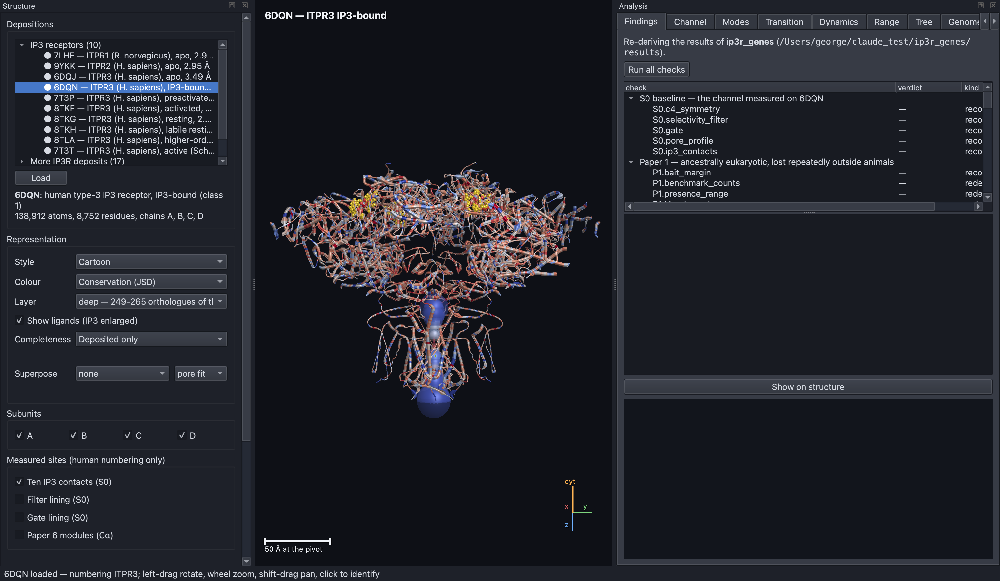
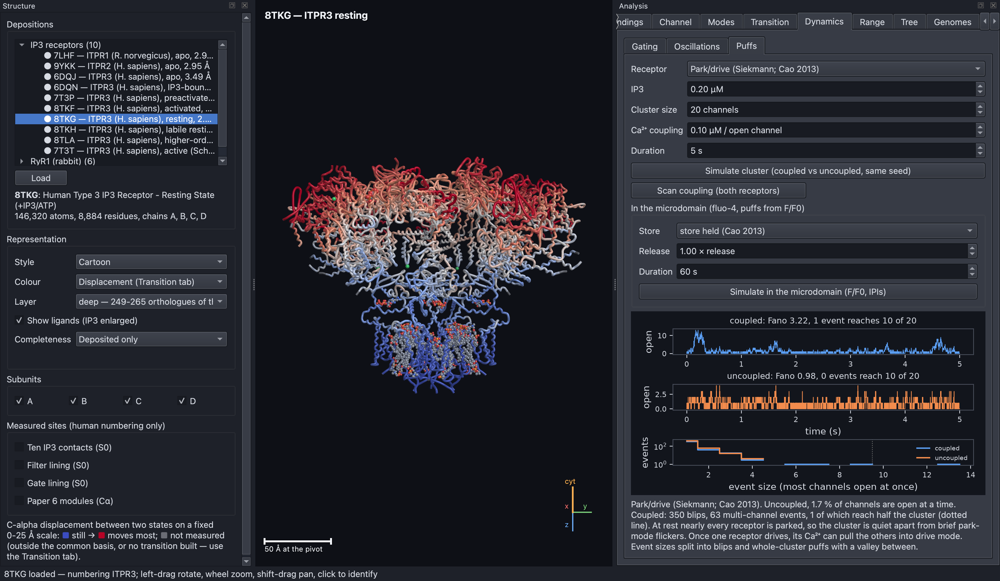

# IP3R Structural Simulator

An interactive, physics-based 3-D model of the **inositol 1,4,5-trisphosphate
receptor (IP3R)**, the channel that releases calcium from the cell's internal
store. It is also an independent checking instrument for the
[`ip3r_genes`](https://github.com/gddickinson/ip3r_genes) publication
project: it re-derives that project's published results from their original
inputs and shows them on the receptor's structure.

The simulator loads experimentally determined structures of the receptor,
measures them, moves them, and runs models of how the channel opens, how
ions pass through it and how clusters of channels produce calcium signals.
Every number a calculation uses is a registered, cited parameter, so each
result can be traced to its source.

<p align="center">
  
</p>

**Figure 1. The main window shows human IP3 receptor type 3 (PDB 6DQN) with
IP3 bound.** The left panel chooses the structure and how it is drawn, the
centre is the 3-D view, and the right panel holds the analysis tabs. The
receptor is drawn side-on with the cytosolic side at the top and the
membrane-embedded pore at the bottom. The colours mark functional regions:
blue, cyan and green for the IP3-binding β-trefoil, MIR and RIH domains at
the top, and violet for the pore domain at the bottom. The gold spheres are
the ten amino acids that touch each bound IP3 molecule, one site on each of
the four subunits. The scale bar and the axis marker ("cyt" points to the
cytosol) sit in the corner of the 3-D view.

## The contents list links to each section below.

1. [This section explains the biology behind the project.](#this-section-explains-the-biology-behind-the-project)
2. [The simulator lets you see, measure, move and test the receptor.](#the-simulator-lets-you-see-measure-move-and-test-the-receptor)
3. [The models have produced several findings so far.](#the-models-have-produced-several-findings-so-far)
4. [You can install the simulator with conda in a few steps.](#you-can-install-the-simulator-with-conda-in-a-few-steps)
5. [You can run the simulator as a desktop app or from the command line.](#you-can-run-the-simulator-as-a-desktop-app-or-from-the-command-line)
6. [The repository is organised into layers, and every module is mapped.](#the-repository-is-organised-into-layers-and-every-module-is-mapped)
7. [Licence, citation and references are listed at the end.](#licence-citation-and-references-are-listed-at-the-end)

## This section explains the biology behind the project.

### Calcium is one of the cell's most widely used signals.

Almost every cell uses short rises in calcium concentration to switch
processes on: muscle contraction, hormone and neurotransmitter release,
fertilisation, gene expression and cell death. At rest the calcium level in
the cytosol (the fluid inside the cell) is kept very low, about 0.1
micromolar (µM). Much higher levels are stored inside the endoplasmic
reticulum (ER), a membrane-bound compartment that acts as the cell's calcium
store. A signal is produced when channels in the ER membrane open and let
calcium flow out into the cytosol.

### The IP3 receptor is the main channel that releases calcium from the store.

When a hormone or neurotransmitter binds to the cell surface, the cell makes
a small messenger molecule called **IP3** (inositol 1,4,5-trisphosphate).
IP3 diffuses to the ER and binds to the IP3 receptor. The receptor also
senses calcium itself. A little cytosolic calcium helps it open, while a lot
shuts it again. This produces a bell-shaped relationship between calcium
concentration and the chance that the channel is open. That self-reinforcing
then self-limiting behaviour lets one open channel trigger its neighbours.
The result is local bursts of release called **puffs**, and at higher IP3
levels, waves and repeating oscillations that sweep across the whole cell.

Humans have three versions (paralogs) of the receptor, encoded by the genes
**ITPR1**, **ITPR2** and **ITPR3**. Each receptor is built from four
identical subunits of about 2,700 amino acids each. The four subunits are
arranged around a central four-fold axis (C4 symmetry), and the axis runs
through the ion-conducting pore. Each subunit has three main parts:

- an **IP3-binding core** at the cytosolic end, where IP3 binds about 70 Å
  from the pore axis;
- large **regulatory domains** (the MIR and RIH domains) that pass the
  binding signal down to the pore;
- a **pore domain** in the membrane. Its **selectivity filter** (the amino
  acid sequence GGGVGD) faces the ER lumen and helps decide which ions pass.
  Its **gate** is a ring of side chains near the cytosolic side that blocks
  the pore when the channel is shut.

### Cryo-electron microscopy has captured the receptor in several states.

Cryo-electron microscopy (cryo-EM) produces atomic models of large proteins,
which are deposited in the Protein Data Bank (PDB) under four-character
codes such as 6DQN. For human ITPR3 there are models of the receptor with no
ligand, with IP3 bound, in resting and inhibited forms, and in an activated,
open form (8TKF). Comparing these states shows how the protein changes shape
when it opens. The simulator measures all of them the same way.

### The ip3r_genes project made claims that this simulator re-derives.

[`ip3r_genes`](https://github.com/gddickinson/ip3r_genes) is a series of six
papers about the receptor family. The papers cover where in the tree of life
the receptor is found, how the three paralogs evolved, where the gene has
been lost, which parts of the protein are most conserved, how disease
variants are distributed, and how the ligand-binding and pore regions
differ. This simulator does not share code with that project. It reads the
same input tables and structures and recomputes the published numbers by its
own route. When the two disagree, the simulator's checker is suspected
first. Genuine disagreements are reported back to the publication project,
which has corrected both of the two found so far.

### The ryanodine receptor is used as a control.

The **ryanodine receptor (RyR)** is the IP3 receptor's larger relative. It
releases calcium in muscle and has been studied more thoroughly: its open
pore's conductance, the effects of charge-changing mutations, and its
calcium "sparks" have all been measured in detail. The simulator runs the
same models on rabbit RyR1. If a model fails on RyR1 as well, the failure
lies in the model rather than in the IP3 receptor structure.

### A short glossary explains the terms used throughout.

| Term | Meaning |
|---|---|
| **Deposit** | One atomic model in the PDB, named by its code (for example 8TKF). |
| **Paralog** | One of the three human receptor genes, ITPR1, ITPR2 or ITPR3. |
| **Lumen** | The inside of the ER, which holds the calcium store. The pore's luminal end faces it. |
| **Pore profile** | The pore's radius measured at each height along the four-fold axis. |
| **Conductance** | How easily ions flow through one open channel, in picosiemens (pS). |
| **P_Ca:P_K** | How much more readily the channel passes calcium than potassium. The measured value for IP3R is 15.2. |
| **Elastic network model** | A model that treats the protein as beads joined by springs, used to find its natural large-scale motions ("modes"). |
| **A, B, E modes** | Motions classified by symmetry. In an A mode all four subunits move alike, which is the only kind that can open a four-fold pore symmetrically. |
| **Puff / spark** | A local burst of calcium release from a cluster of IP3 receptors (puff) or ryanodine receptors (spark). |
| **JSD conservation** | A per-residue score of how little an amino acid position varies across species. A higher score means the position is more conserved. |
| **VUS** | A "variant of uncertain significance": a human DNA change that has not been classified as harmful or harmless. |

## The simulator lets you see, measure, move and test the receptor.

### The viewer draws each structure and colours it by what is known about it.

The viewer draws the nine curated IP3R structures that the publication uses,
one control structure (7T3T), 17 further full-length IP3R structures and six
RyR1 structures. Each can be shown as a cartoon, tube, spheres or sticks.
It can be coloured by functional region, subunit, secondary structure,
crystallographic B-factor, conservation, distance to IP3, or disease
variant. Information tied to residue numbers is only painted when the
simulator has confirmed that the structure uses the same human numbering.
The rat structure 7LHF does not, so it is shown grey rather than guessed.
You can click residues to select them, measure distances, open a sequence
window, superpose two states and fill unresolved parts of the structure from
an AlphaFold prediction.



**Figure 2. Conservation is painted on the structure on a fixed scale.**
The same 6DQN structure is coloured by how conserved each position is across
roughly 250 species (the "deep" layer), from blue (variable) to red (highly
conserved). The scale is fixed at 0.50–0.95 so that colours mean the same on
every structure, and positions without a score are grey. The translucent
blue tube down the centre is the pore, drawn at its measured radius; it
pinches shut where the gate closes it.

### Measuring the pore shows that only the activated structure is open.

The simulator finds the four-fold axis by superposing each subunit onto its
neighbour. It then measures the pore radius along the axis, locates the
filter and the gate, and lists every contact with bound IP3. Applied to every
ITPR3 structure, it shows the opening at the gate:

| PDB | State | Gate radius (Å) |
|---|---|---|
| 8TKH | labile resting | 1.95 |
| 8TLA | higher-order inhibited | 2.44 |
| 7T3P | preactivated | 2.53 |
| 6DQN | IP3-bound | 2.55 |
| 6DQJ | apo (no ligand) | 2.69 |
| 8TKG | resting | 2.73 |
| **8TKF** | **activated** | **5.85** |

The 11 other full-length ITPR3 structures in the PDB are all shut (gate
radius 1.57–2.59 Å). So 8TKF and the independent control 7T3T are the only
open IP3R pores that have been deposited.


**Figure 3. The gate widens only in the activated structures.** Panel (a)
overlays the pore radius of every ITPR3 state, aligned so that the selectivity
filter sits at zero. The lumen is to the left and the cytosol to the right.
All states share the same narrow filter at zero, but only activated 8TKF
(thick red) and the control 7T3T (dashed grey) stay wide through the gate
region 10–20 Å cytosolic of it. Panel (b) plots the radius at the gate
(orange) and at the filter (blue) for each state. The filter barely changes,
while the gate more than doubles in the active states.

### The morph shows how the receptor moves from resting to open.

The Transition tab matches the same 2,194 residues on each of the four
subunits of resting 8TKG and activated 8TKF. It aligns the two structures on
their pore domain and interpolates between them, keeping neighbouring
backbone atoms at their correct spacing. The result is a plausible path, not
a simulated trajectory. The large cytosolic domains move 17–22 Å on average,
while the pore domain moves about 2.5 Å.

The tab then asks whether the resting structure's natural motions (from the
elastic network model) point towards the open state. They do: the symmetric
A motions together account for 0.67 of the observed movement, whereas a
random direction with the same symmetry accounts for 0.04. No single mode
explains it on its own.


**Figure 4. The resting structure's natural motions point towards the open
state.** The structure is 8TKG coloured by how far each residue moves on the
way to 8TKF, on a fixed 0–25 Å scale from blue (still) to red (moves most).
The cytosolic cap moves most and the membrane pore least. The upper plot
adds the symmetric A modes one at a time, lowest first: together they
capture 0.67 of the movement (white line), far above the 0.04 expected by
chance (dotted line). The lower plot follows the gate radius along the path,
from 2.73 to 5.85 Å. It is halfway open at 0.42 of the way along. The dashed
line shows that keeping side chains rigid would leave the gate 0.7 Å short.

### The gating models reproduce the receptor's bell-shaped calcium response.

The Dynamics tab runs three published models of how calcium and IP3 control
opening. They are the De Young–Keizer model (as simplified by Li and
Rinzel), the model Mak, McBride and Foskett (1998) fitted to single
channels, and the park/drive model of Siekmann and Cao. Each gives the
bell-shaped curve and can be compared at the same IP3 levels. The same tab
simulates whole-cell calcium oscillations and stochastic clusters of
channels.


**Figure 5. Three published gating models are compared on one set of
axes.** Each curve is the probability that a channel is open (vertical)
against cytosolic calcium on a log scale (horizontal), at a low (33 nM) and
a high (10 µM) IP3 concentration. Each curve is scaled to its own peak so
that the shapes can be compared. In the measurements, raising IP3 mainly
shifts the point where high calcium shuts the channel (the right-hand side of
the bell). The Mak and park/drive models reproduce this; De Young–Keizer
also moves the left-hand side.



**Figure 6. Calcium coupling turns scattered single openings into
coordinated puffs.** A cluster of 20 park/drive receptors is simulated for
5 seconds at 0.2 µM IP3, twice with the same random numbers. In the upper
trace (coupled) each open channel raises the calcium its neighbours see, so
openings bunch into puffs in which many channels open together. In the
middle trace (uncoupled) channels open independently and never more than a
few at once. The histogram shows that the coupled cluster produces a separate
population of large events. The high Fano factor (3.22) measures this
bunching.

### The permeation models turn each pore's shape into a predicted current.

The Channel tab and several command-line analyses estimate how fast ions flow
through each open pore. They start from a one-dimensional drift-diffusion
model and go on to three-dimensional solutions in the real shape of the
lumen. The models include the charges on the pore wall, the image force from
the low-permittivity protein, ion size and crowding, and the bi-ionic
experiments used to measure selectivity. The results so far are summarised
[below](#the-models-have-produced-several-findings-so-far). The full account,
with every figure, is in [`docs/RESULTS.md`](docs/RESULTS.md).


**Figure 7. The simulator draws the open pore's lumen and shows where the
voltage falls.** The coloured surface inside activated 8TKF is the space
available to a potassium ion, coloured by the electric potential from the
lumen (blue) to the cytosol (red). The upper plot compares the lumen's
cross-sectional area in 3-D (blue) with the simpler 1-D model (green), which
keeps only the largest inscribed circle. The lower plot shows how much of the
applied voltage has been dropped at each height. The two models agree on
where the voltage falls: 32 % across the filter in 3-D and 35 % in 1-D.

### The Findings tab re-derives 52 results from the publication.

The Findings tab runs 52 checks against the `ip3r_genes` papers and their
structural baseline. Each check is labelled by how independent it is:

- **recomputed** (9 checks): measured again from the atomic coordinates with
  code the two projects do not share;
- **rederived** (39 checks): computed again from the publication's input
  tables with this project's own arithmetic;
- **read** (4 checks): the publication's table is read and its prose is
  tested against it.

All 52 are confirmed as of `ip3r_genes` supplement S29. Every check is
calibrated: a test plants a change in one of its input tables and requires the
verdict to flip. Details of each check are in
[`docs/SCIENCE_CHECKS.md`](docs/SCIENCE_CHECKS.md).


**Figure 8. Each finding shows the claim, the method, the verdict and a
plot.** The list at the top groups the checks by paper, each with its
verdict (green means confirmed) and kind. The selected check,
`S0.pore_profile`, compares the published pore radius of 6DQN with the one
measured here. The text states the claim, how it was re-derived, the source
files, and the rule for agreement. The plot below overlays the published
profile (orange) and the recomputed one (dashed blue). They coincide, with
99.3 % of points within 0.05 Å.

### Further tabs present the publication's evolutionary and genetic results.

- **Tree** draws the receptor family's evolutionary tree (134 proteins,
  rooted on the ryanodine receptors) with each paralog's clade boxed.
- **Genomes** shows 309 genome assemblies as a grid of which receptor genes
  were found, missed or damaged, beside each assembly's quality.
- **Range** shows what fraction of 6,928 proteomes carry a receptor, clade by
  clade across the tree of life.
- **Variants** puts human disease variants on the structure and places each
  VUS relative to the known harmful and harmless variants.

Each of these tabs is described, with figures, in
[`docs/USER_GUIDE.md`](docs/USER_GUIDE.md).

## The models have produced several findings so far.

These are the main results. The evidence behind each, and the figures, are in
[`docs/RESULTS.md`](docs/RESULTS.md).

1. **Only the activated structure conducts, and it conducts too little.** The
   simple model predicts 65 pS for 8TKF, against 358–545 pS measured. Solving
   in the lumen's real 3-D shape raises the prediction 1.3–2.0×. The same
   method gives RyR1's measured conductance almost exactly (787 against 801
   pS), so the remaining IP3R shortfall is real.
2. **The charged wall alone cannot explain calcium selectivity.** No reading
   of the wall's charges, protonation states, electrostatic treatments, image
   forces or ion crowding lifts P_Ca:P_K above about 2, against 15.2 measured. RyR1 fails
   in the same way, which points to the model's treatment of ions rather than
   to the IP3R structure.
3. **The gate's shape and the measuring protocol are not the problem.**
   Widening the gate by up to 4 Å moves P_Ca:P_K by less than 20 %, and
   simulating the full bi-ionic reversal experiment moves it by 15 % or less.
4. **A mathematical bound rules out every smooth potential.** For point ions
   passing in single file, the product of the two measured ratios cannot
   exceed 1 relative to an uncharged pore. The measured pair needs about 3,200.
5. **A calcium-binding site that blocks potassium reproduces both measured
   ratios.** A saturable calcium site spanning the pore, compensated by fixed
   charge and blocking K⁺ when occupied, reaches 15.2 at a binding energy of
   about 4 kT (dissociation constant 3–6 mM). This is the
   "anomalous mole-fraction" mechanism known from calcium channels.
6. **That site makes a testable prediction.** Sweeping luminal calcium from
   0.1 to 100 mM, P_Ca:P_K should peak near 10 mM, and the K⁺ current should
   halve at 6–16 mM luminal calcium.
7. **Ryanodine receptor sparks need magnesium to end.** A calcium-only gating
   scheme fitted to RyR1's measured calcium response never ends a spark.
   Adding the muscle fibre's 1 mM free magnesium ends it in about 6 ms, as
   measured.

## You can install the simulator with conda in a few steps.

### The simulator needs Python 3.11 and a machine with OpenGL 4.1.

- **Operating system:** developed on macOS; Linux should work. The viewer
  needs OpenGL 4.1.
- **Python:** 3.11 or later, with NumPy, SciPy and Matplotlib. The viewer
  also needs PyQt6 and moderngl, and the protonation analysis uses PROPKA
  3.5.1.
- **Disk:** about 90 MB for the downloaded structures and AlphaFold models.
- **Optional:** a copy of [`ip3r_genes`](https://github.com/gddickinson/ip3r_genes)
  for the Findings tab and the publication tabs. Everything else runs without
  it.

### The installation takes four commands.

```bash
git clone https://github.com/gddickinson/ip3r-simulator.git
cd ip3r-simulator
bash scripts/create_env.sh     # creates the "ip3r_sim" conda environment (or: make env)
conda activate ip3r_sim
make fetch                     # downloads the 33 structures (~86 MB) and AlphaFold models into ref/
```

If you prefer pip, `pip install -e ".[all]"` installs the package with the
viewer and developer tools (then add `pip install propka==3.5.1`).

To enable the publication checks, clone `ip3r_genes` next to this repository
(so that `../ip3r_genes` exists) or point to it with an environment variable:

```bash
export IP3R_GENES_DIR=/path/to/ip3r_genes
```

If you already have the structure files, `IP3R_STRUCTURE_MIRROR=/path/to/dir`
makes `make fetch` copy them rather than download them.

## You can run the simulator as a desktop app or from the command line.

### The desktop app opens with a single command.

```bash
python -m ip3r                        # opens the app on 6DQN
./run_app.command                     # the same, activating the environment first (double-click in Finder)
python -m ip3r --session view.json    # reopens a saved view
```

Drag with the left mouse button to rotate, shift-drag to pan and use the
scroll wheel to zoom. Click a residue to select it and right-click for a
menu of actions. **Ctrl+1** gives the side view, **Ctrl+2** looks down the
pore and **Ctrl+3** centres on an IP3 binding site. **F11** switches to full
screen and **F1** opens the built-in guide. The full list of controls,
panels, the parameter editor and saved sessions is in
[`docs/USER_GUIDE.md`](docs/USER_GUIDE.md).

### Every analysis can also be run from the command line.

The science runs without the viewer, which suits scripts and remote
machines. The most useful commands are:

```bash
python -m ip3r info 8TKF          # measure one structure: axis, numbering, pore, filter, gate, IP3 contacts
python -m ip3r states             # gate and filter radius of every ITPR3 state
python -m ip3r checks             # re-derive the ip3r_genes findings (needs ip3r_genes)
python -m ip3r transition 8TKG 8TKF   # morph resting -> open and compare it with the normal modes
python -m ip3r unitary            # predicted K+ conductance of each state against the measurements
python -m ip3r gating --model mak # the Mak 1998 gating model's bell-shaped curve
python -m ip3r puffs --model park-drive   # a stochastic cluster of park/drive receptors
python -m ip3r params             # every registered parameter with its unit, bounds and source
make help                         # every maintenance task
```

The complete list of commands and their options is in
[`docs/USER_GUIDE.md`](docs/USER_GUIDE.md#every-command-line-analysis-is-listed-here-by-topic).
The desktop app's **Analyses** menu runs the same commands in their own
window.

### Any parameter can be changed, and the change is always visible.

Every constant is listed in the parameter editor (Help → Parameters, or
**Ctrl+Shift+P**) with its default, bounds and source. When anything differs
from its default, an amber banner appears and the findings checks report
*not run* rather than *confirmed*. An edited set can be exported and replayed
headless with `IP3R_PARAMETERS=file.json python -m ip3r …`.

## The repository is organised into layers, and every module is mapped.

The code is split into layers that depend in one direction:
`io → core → structure → physics → analysis`, with the renderer (`render`)
and the desktop app (`ui`) consuming them. The science never imports the
viewer, so it runs headless in the command line, tests and notebooks.
[`INTERFACE.md`](INTERFACE.md) maps every module, class and function, and
[`CONTRIBUTING.md`](CONTRIBUTING.md) describes the layout, the tests and the
project rules for anyone changing the code.

The tests run with `make test` (about 740 tests; those needing missing data
are skipped). `make screenshots` drives the real app through every panel,
fails on a broken one, and rewrites the screenshots in `docs/img/`.

The documents in `docs/` explain the models:

| Document | Subject |
|---|---|
| [`docs/USER_GUIDE.md`](docs/USER_GUIDE.md) | using the app and the command line, with the tab-by-tab figures |
| [`docs/RESULTS.md`](docs/RESULTS.md) | the conductance and selectivity results in plain language, IP3R and RyR1 |
| [`docs/RESULTS_DYNAMICS.md`](docs/RESULTS_DYNAMICS.md) | the gating, puff and spark results in plain language |
| [`docs/SCIENCE.md`](docs/SCIENCE.md) | the models, their equations and sources |
| [`docs/SCIENCE_CHECKS.md`](docs/SCIENCE_CHECKS.md) | every findings check, paper by paper |
| [`docs/SCIENCE_PERM.md`](docs/SCIENCE_PERM.md) | the pore permeation model and selectivity |
| [`docs/SCIENCE_RYR.md`](docs/SCIENCE_RYR.md), [`docs/SCIENCE_EC.md`](docs/SCIENCE_EC.md) | the ryanodine receptor, sparks and excitation–contraction coupling |
| `docs/SCIENCE_*.md` (others) | one document per modelling round: image forces, salt bridges, ion crowding, 3-D selectivity, the gate, reversal, the wall search, the calcium site |
| [`ROADMAP.md`](ROADMAP.md), [`SESSION_LOG.md`](SESSION_LOG.md) | what is planned and what was done, with the reasons |

## Licence, citation and references are listed at the end.

### The code is released under the MIT licence.

The licence is declared in [`pyproject.toml`](pyproject.toml). Structures come
from the [RCSB Protein Data Bank](https://www.rcsb.org) and predicted models
from the [AlphaFold Protein Structure Database](https://alphafold.ebi.ac.uk);
please cite the original depositors and AlphaFold when you use them. The
renderer, file reader, camera and parameter registry are ported from the
[PIEZO1 simulator](https://github.com/gddickinson/piezo1-simulator).

### Please cite the simulator and the publication project together.

If you use this software, please cite this repository
(`https://github.com/gddickinson/ip3r-simulator`) and the `ip3r_genes`
project whose results it re-derives.

### The main modelling sources are listed here.

De Young & Keizer 1992 (PNAS 89:9895); Li & Rinzel 1994 (J Theor Biol
166:461); Bezprozvanny, Watras & Ehrlich 1991 (Nature 351:751); Mak, McBride
& Foskett 1998 (PNAS 95:15821); Swillens et al. 1999 (PNAS 96:13750); Shuai &
Jung 2002 (Biophys J 83:87); Siekmann et al. 2012 (Biophys J 103:658); Cao et
al. 2013 (Biophys J 105:1133); Cao et al. 2014 (PLoS Comput Biol
10:e1003783); Smith & Parker 2009 (PNAS 106:6404); Paknejad & Hite 2018
(NSMB 25:660); Atilgan et al. 2001 (Biophys J 80:505); Yang, Song & Jernigan
2009 (PNAS 106:12347); Tama & Sanejouand 2001 (Protein Eng 14:1);
Brüschweiler 1995 (J Chem Phys 102:3396); Kabsch 1976 (Acta Cryst A32:922);
Hanley & McNeil 1982 (Radiology 143:29); Barlow & Thornton 1983 (J Mol Biol
168:867); Vais et al. 2010 (J Gen Physiol 136:687); Xu et al. 2006 (Biophys J
90:443); Stern, Pizarro & Ríos 1997 (J Gen Physiol 110:415); Murayama et al.
2015 (PLoS One 10:e0130606); Ríos et al. 1999 (J Gen Physiol 114:31).
Every reference, with the parameters that rely on it, is in
`ip3r/resources/references.json`.
