# Results of the permeation and selectivity models

This document explains, in plain language, what the simulator's physical
models have found so far. It covers how ions pass through the open IP3
receptor pore, why the channel prefers calcium, and what the ryanodine
receptor's pore shows as a control. The [README](../README.md) gives the
background and a summary, and [`RESULTS_DYNAMICS.md`](RESULTS_DYNAMICS.md)
covers gating, puffs and sparks. The equations, sources and calibrations are in the `SCIENCE_*.md`
documents named in each section. Every command shown can be run with
`python -m ip3r …`.

## A few terms are used throughout this document.

- **Conductance** is how easily ions flow through one open channel, in
  picosiemens (pS). Two measurements exist for the open IP3 receptor with
  potassium as the carrier: 358 pS (Mak 2000) and 545 pS (Vais 2010).
- **Selectivity** is written P_Ca:P_K, the ratio of the channel's
  permeability to calcium over its permeability to potassium. Vais et al.
  (2010) measured 15.2 for IP3R type 3, and P_Cl:P_K (chloride over potassium)
  of 0.27. A ratio does not depend on how fast ions diffuse, which is not
  known inside a pore, so it tests the pore's chemistry directly.
- **kT** is the unit of thermal energy (about 2.5 kJ/mol at room
  temperature). An energy of a few kT is enough to change where ions sit.
- A **closure** is one way of turning the pore wall's fixed charges into the
  electric potential the ions feel. The simplest assumes each slice of the
  pore is locally neutral. The most complete solves the Poisson–Boltzmann
  equation, which lets the field spread along the pore.
- **1-D** models treat the pore as a stack of circular slices; **3-D** models
  solve the same physics on a grid of small cubes (voxels) filling the pore's
  real shape.

## The open IP3 receptor pore conducts, but less than the real channel.

`python -m ip3r unitary` turns each ITPR3 structure's pore into a potassium
conductance using a drift-diffusion model ported from the PIEZO1 simulator.
Only the activated structure 8TKF conducts. It gives 65 pS with an uncharged
wall. Allowing for the unknown diffusion speed and ion radius, the range is
25–150 pS, against 358–545 pS measured. So even at its most generous the
simple model falls 2.4 times short. Adding the charges of the amino acids that
line the pore lowers the conductance rather than raising it. Treating the
filter's salt-bridged pair (aspartate D2478 with arginine R2471 of the next
subunit) as cancelled lowers it further, to 23 pS.

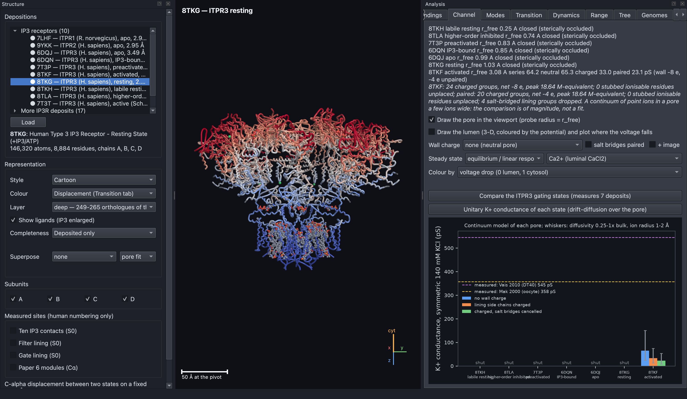

**Figure R1. Only the activated structure conducts, and it conducts too
little.** Each ITPR3 state is shown with its predicted potassium conductance
in symmetric 140 mM KCl. Six states are labelled "shut" because an ion cannot
pass their gate. Only 8TKF on the right has bars. The blue bar is the
uncharged wall, orange includes the lining charges, and green cancels the
salt-bridged charges. The whiskers show the range over the unknown
diffusion speed and ion size. The dashed lines are the two measured values
(358 and 545 pS), far above every bar. The structure behind the plot is
coloured by how far each residue moves between resting and activated states.

### Most of the shortfall comes from the simple model's geometry.

The 1-D model reduces each slice of the pore to the largest circle that fits
in it, so it ignores the corners of the real lumen. Solved in 3-D on the
voxelised lumen, the same electrolyte conducts 1.3–2.0 times more
(`python -m ip3r shortfall`). The gap is not because 8TKF shows a partly open
substate: an independent active-state structure, 7T3T (Schmitz et al.
2022), gives almost the same answer (85 against 106 pS). Moving the exit
window changes the answer by only 2 %. At bulk diffusion speed with a 1 Å
exclusion zone, RyR1's open structure gives 787 pS against 801 pS measured,
while ITPR3 gives 261–278 pS against 358–545 pS. The method works on RyR1,
so the IP3R shortfall is real.

### The 3-D and 1-D models agree on where the voltage falls.

The corners change how much current flows but not where the voltage drops
(`python -m ip3r lumen`, or "Draw the lumen" in the Channel panel). In 8TKF,
7T3T and RyR1's 9HEO, the 3-D and 1-D models put the halfway point of the
voltage drop within 1.3 Å of each other. The filter's share of the drop agrees
within 4 percentage points (8TKF: 32 % in 3-D against 35 % in 1-D). This is
Figure 5 of the README.

## The pore wall's charges matter in ways that depend on how they are modelled.

### The wall's effect on conductance changes sign when solved in 3-D.

In 1-D the lining charges lower 8TKF's conductance to 0.46 of the uncharged
value. In 3-D (`python -m ip3r wall3d`) the full wall multiplies it by 0.80,
1.24 or 3.1, depending on whether the charge is spread over each
cross-section, placed at each amino acid's own position, or solved with
Poisson–Boltzmann. One unmeasured constant, how widely each charge is
smeared, moves the 3-D answer anywhere from 0.4 to 5.7 times. With the
filter's D2478 salt bridges treated as paired, the wall lowers the
conductance under every closure (0.45–0.59 times). RyR1's charge mutants
cannot tell the closures apart: all of them miss the D4899Q mutant (0.20
times measured) by a factor of four.

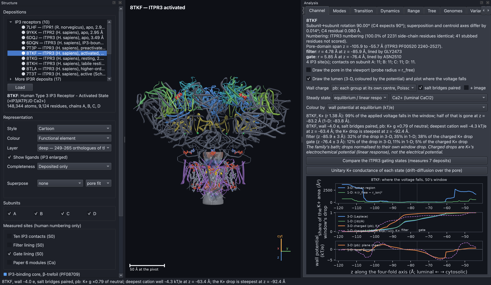

**Figure R2. The wall's charges change where the voltage falls, not only how
much current flows.** The surface of 8TKF's lumen is coloured by the
electric potential the wall's charges create at equilibrium, on a fixed
±5 kT/e scale (blue marks wells that attract cations). Here the charges are
solved by Poisson–Boltzmann with the salt-bridged pairs cancelled. The middle
plot compares potassium's drop in the charged pore (orange) with the
uncharged pore (blue and green), and the bottom plot shows the wall
potential along the axis. In an uncharged pore the filter
carries 32 % of the voltage drop. With the full charged wall it carries only
1–18 %, because the D2478 ring forms a well for cations. With the salt
bridges paired, the filter's share returns to 23–38 %. Where the voltage
falls therefore depends on whether D2478 is charged.

### The salt bridge in the filter is two charges, not a neutral pair.

`python -m ip3r bridge` (see `SCIENCE_BRIDGE.md`) settles whether D2478 is
charged. Both independent methods of estimating its pKa say it is ionised.
A pKa is the acidity at which a group is half charged. The network method
gives pKa 2.0–2.2 with its arginine partner counted and 4.0–4.8 without it,
and PROPKA gives 5.2. All are well below the recording pH of 7.3, and the
arginine never loses its charge. So the pair is two opposite charges, a small
dipole behind the filter wall, and neither "fully charged" nor "cancelled" is
a physical state.

A new closure solves Poisson–Boltzmann over the whole box. It gives the
protein a low permittivity (ε 4, meaning it screens charge far less than
water) and places every charged group at its own position. It puts 8TKF's
wall effect at 3.18 times. That lies between omitting the arginine partner
(5.30) and omitting the pair (1.79), and 7T3T gives 3.47. Changing the
protein's permittivity from 2 to 20 moves this by less than 3 %. RyR1's D4899Q
is still missed (0.79 predicted against 0.20 measured), so no placement of
point charges explains it.

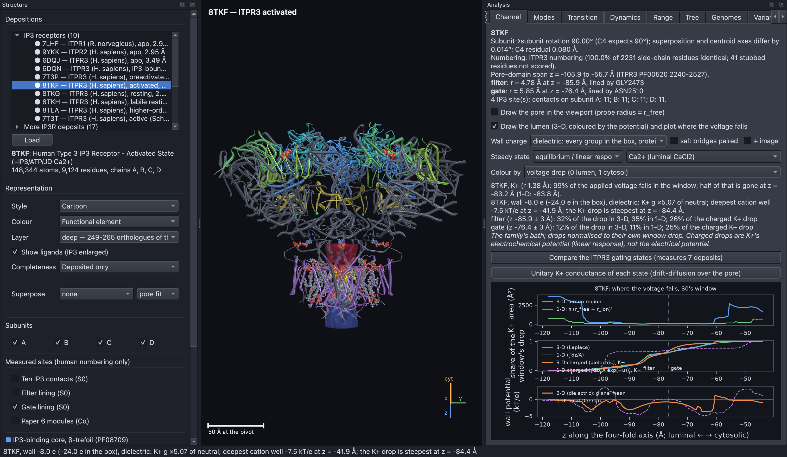

**Figure R3. The salt bridge treated as a dipole keeps the voltage drop at
the filter.** The lumen of 8TKF is coloured by where potassium's voltage
drop falls, under the closure that includes the protein as a low-permittivity
medium. The D2478–R2471 pair is treated as a dipole. This dipole gives the
same conductance as the full wall under Poisson–Boltzmann (about 5 times the
uncharged value), but a different profile. The full wall moves the steepest
drop 25 Å towards the cytosol and leaves the filter only 18 %. The dipole
keeps the steepest drop at the filter with 26 % (uncharged pore 32 %, pair
omitted 41 %). A conductance cannot distinguish these readings, but the drawn
voltage drop can.

### The image force costs a neutral pore more than a charged one.

An ion near a wall of lower permittivity than water is pushed away by the
polarisation it induces, which is called the image force. `python -m ip3r
born` (see `SCIENCE_BORN.md`) solves that cost voxel by voxel. On the axis at
the filter it is about 1 kT (8TKF 1.19, 7T3T 1.54, 9HEO 0.77) and four times
that for calcium. It cuts an uncharged pore's potassium conductance to 0.20–0.28
of its value, but it costs the charged ITPR3 pore almost nothing (8TKF's
dipole reading moves from 3.38 to 3.42 times). Where the wall charge
dominates, the counter-ions are held in place by the need for neutrality and
the potential absorbs the cost. RyR1's wall does not pin them everywhere, so
9HEO falls from 3.86 to 2.18 times. The image force moves D4899Q from 0.79 to
0.48, but it moves D4938N further in the wrong direction (0.74 to 0.28 against
0.65 measured). The mutants' total error is therefore unchanged, and the
image force is not what makes D4899 special.

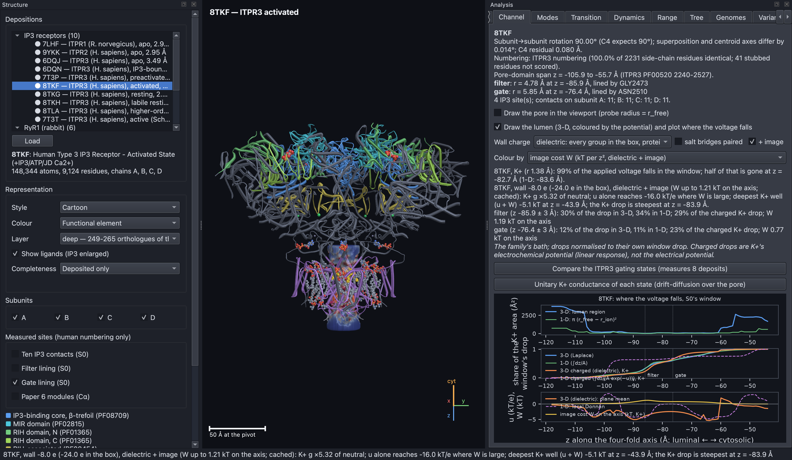

**Figure R4. The image force is largest in the narrow filter.** 8TKF's lumen
is coloured by the image energy W an ion pays for being near the
low-permittivity protein, on a fixed scale starting at zero. The cost rises
where the lumen narrows and the protein is close on all sides. This view
uses a 1 Å grid and loads from a cache in about 20 seconds.

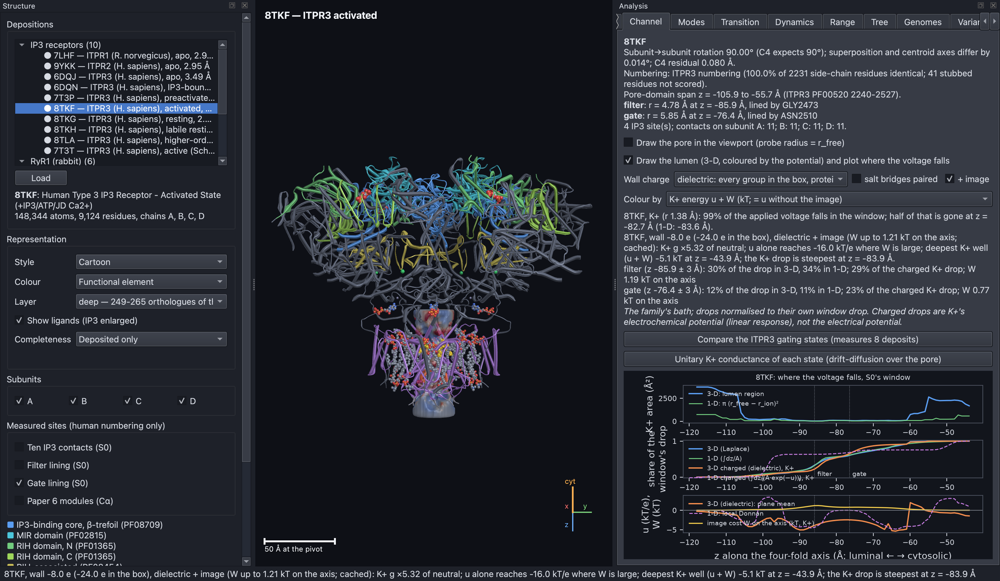

**Figure R5. The energy a potassium ion actually feels is the wall's
potential plus the image cost.** The lumen is coloured by u + W, where u is
the electrostatic potential from the wall charges and W is the image energy,
on the same fixed ± scale as Figure R2. The potential u alone reaches −16 kT/e
at the wall. The image cost makes the potassium well shallower (8TKF: −6.2 to
−5.1 kT). It also moves ITPR3's potassium drop back to the filter: with the
dipole, the filter carries 29 % (24 % without W), close to the uncharged
pore's 30 %.

### Ion size and crowding make the filter bind calcium, but selectivity stays low.

Real ions have size, and in a narrow charged pore they crowd each other. A
model that includes this "charge–space competition" (hard spheres plus the
mean spherical approximation, as used by Nonner 2000 and Gillespie 2008) is
run by `python -m ip3r csc` (see `SCIENCE_CSC.md`). RyR1's filter now binds
calcium as Gillespie's model does. At 150 mM potassium and 1 mM calcium it
holds 10 M calcium against 0.9 M potassium, with an electrostatic advantage
of 4.2 kT and a packing advantage of 0.9 kT (Gillespie: about 4 and 0.5–1).
But P_Ca:P_K only rises from 0.46 to 0.64, against 7.0 measured. The reason
is that the uncharged gate region lies in series with the filter and holds
72 % of calcium's resistance. On its own that region gives 0.54, simply the
ratio of the two ions' diffusion speeds and sizes. The model is missing the
electric field at the gate, not better filter physics.

### Solving selectivity in 3-D lets the field reach the gate, but not far enough.

In 3-D the wall's field does reach the gate (`python -m ip3r sel3d`, see
`SCIENCE_SEL3D.md`). Selectivity is read from how each ion's current
responds to a small voltage, with the crowded fluid included in every voxel.
The filter still binds calcium (8.6 M against 1.2 M potassium in 9HEO). But
the ratio reaches only 1.08 in RyR1 (7.0 measured; 0.87 in 1-D) and 1.39 and
1.79 in ITPR3's 8TKF and 7T3T (15.2 measured; 0.34 and 0.63 in 1-D). RyR1's
gate still holds over half of calcium's resistance. The only constant that
moves the result much is how far each charge is spread towards the gate (at
6 Å smoothing: 2.7). The RyR1 mutants still do not single out D4899Q.

## No smooth pore wall reproduces the measured calcium selectivity.

### The simple model's selectivity falls far short of the measurement.

`python -m ip3r selectivity` runs Vais et al.'s own solutions through the
8TKF pore. No reading of the wall comes near 15.2. It gives 0.17 uncharged,
0.00 with the lining charges and 0.69 with only the acidic rings. The model's
calcium current is at most 0.046 pA/mM against 0.30 measured. The lining
lysines act as barriers to calcium. Calibration shows that charges arranged
in separate rings cannot make a continuum pore calcium-selective, whereas a
continuous charged tract can (see `SCIENCE_PERM.md`). Solving
Poisson–Boltzmann across each slice (`--closure radial`) screens the
vestibule's lysine ring but lifts the charged reading only to 0.04.

### Protonation is not the missing piece.

`python -m ip3r protonation` estimates the charge of every lining group two
ways: a Tanford–Kirkwood network sampled by Monte Carlo, and PROPKA 3. Both
keep every lining group of 8TKF charged at pH 7.3. The lysine rings stay
charged even at a protein-like permittivity of 4, where the acid rings lose
up to half their charge. No combination of rings fully charged or neutral
exceeds P_Ca:P_K 0.69, and with the lysines charged none exceeds 0.05. RyR1's
open structure, run through Xu et al. (2006)'s protocol as a control, fails
the same way (0.46 against 7.0). The missing piece is in the continuum model,
not the IP3R wall.

### The gate's shape does not limit selectivity.

`python -m ip3r gate` (see `SCIENCE_GATE.md`) widens a structure's gate by
up to 4 Å, keeping its four-fold symmetry, and reads the pore again. On 9HEO
the gate's share of calcium's resistance falls from 53 % to 6 %, yet P_Ca:P_K
moves only from 1.08 to 1.27 against 7.0. On 8TKF it moves from 1.39 to 1.50
against 15.2, and on 7T3T it falls. Potassium conductance rises by at most
24 %. Neither the conductance shortfall nor the selectivity gap is caused by
the gate's shape.

### Simulating the full reversal experiment does not change the answer.

Selectivity is measured by bathing the two sides of the channel in different
salts and finding the voltage at which no net current flows (the reversal
potential). `python -m ip3r reversal` (see `SCIENCE_REVERSAL.md`) runs Xu's
and Vais's experiments through the 3-D charged lumen. It solves the full
Poisson–Nernst–Planck equations at steady state and finds the voltage where
the net current is zero. At reversal, P_Ca:P_K lies within 15 % of the
small-voltage reading (9HEO 0.90 against 7.0; 8TKF 1.15 and 7T3T 1.54
against 15.2). Meanwhile the charged wall shuts out chloride almost entirely
(P_Cl:P_K 0.003 against 0.27 measured). Scaling 8TKF's wall charge from zero
to double never gives both measured ratios at once.

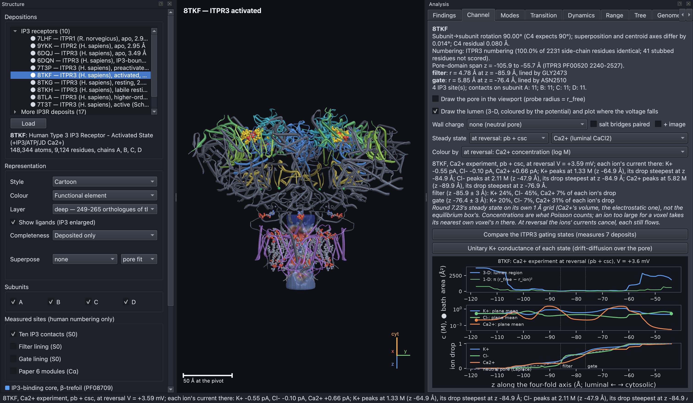

**Figure R6. At reversal, calcium gathers near the filter, but its resistance
lies in the uncharged stretch beyond.** 8TKF is shown during Vais's calcium
experiment (10 mM luminal CaCl₂) at its reversal potential of +3.6 mV,
under the most complete model (Poisson–Boltzmann plus ion crowding). The
lumen is coloured by calcium concentration on a log scale. The middle plot
shows each ion's average concentration along the pore: calcium (orange)
rises to about 6 M just luminal of the filter. The bottom plot shows where
each ion loses its driving force. The calcium well carries only 7 % of
calcium's drop, while 31 % falls in the uncharged stretch at the gate.

### A mathematical bound explains why no smooth potential can work.

`python -m ip3r wallsearch` (see `SCIENCE_WALLSEARCH.md`) scores wall models
on both measured ratios together. Take each ratio relative to the uncharged
pore. For point ions passing in single file, a standard inequality (Hölder's)
proves that (P_Cl:P_K) × (P_Ca:P_K)² can never exceed 1, whatever the shape of
the potential. Vais's measured pair needs about 3,200. The two ways around the
bound that a charged wall allows are small. The non-linearity of the reversal
experiment reaches 1.2. Rings of opposite charge side by side reach 1.01 in
8TKF and 7.9 only in 7T3T's wide gate, and that gain goes to chloride. A well
that attracts only calcium leaves chloride alone but peaks at P_Ca:P_K 4.5
(8TKF) and 6.9 (7T3T). Deeper wells fill with calcium, which then repels
more calcium. The measured pair needs an interaction the continuum model does
not contain, such as bound calcium blocking potassium.

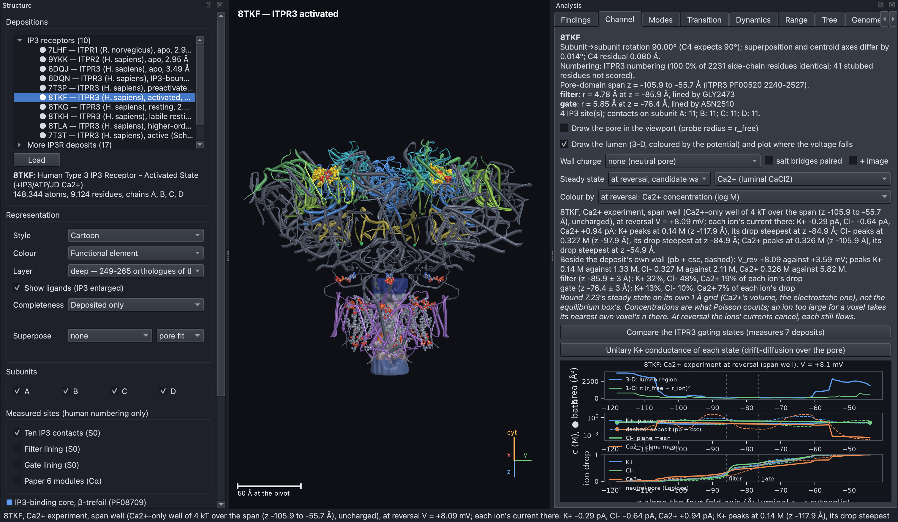

**Figure R7. A calcium-only well gathers calcium but traps it at its edge.**
The lumen box can draw each candidate wall from the search. Here a well that
attracts only calcium spans 8TKF's membrane region. The lumen is coloured by
calcium concentration at reversal, and the structure's own wall is plotted
dashed beside it for comparison. Inside the well, calcium's resistance sits
at the well's cytosolic edge, where it has to climb out.

## A calcium-binding site that blocks potassium reproduces both measured ratios.

`python -m ip3r casite` (see `SCIENCE_CASITE.md`) adds a saturable calcium
binding site along the pore span: four sites whose binding energy is the
depth d. The site can be **compensated** (each bound calcium adds −2e of fixed
charge, so binding does not change the net charge) and it can **block**
potassium when occupied. Affinity alone falls short. Uncompensated sites
peak near 5 (8TKF) and 7 (7T3T), and compensated ones level off at 9.1 and
13.3 when full. Compensated and blocking together, the site crosses 15.2 at
d = 4.4 kT (8TKF) and 4.0 kT (7T3T), a dissociation constant of 3–6 mM, with
8TKF's site half occupied. Chloride selectivity stays at the uncharged
pore's value (0.29 and 0.37). This is the "anomalous mole-fraction"
mechanism known from voltage-gated calcium channels.

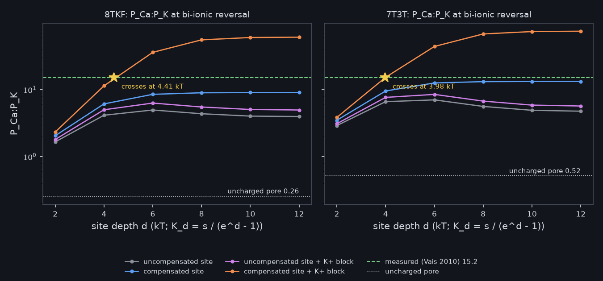

**Figure R8. Only a compensated site that blocks potassium reaches the
measured selectivity.** Each panel plots P_Ca:P_K at reversal (log scale)
against the binding depth of the site, for 8TKF (left) and 7T3T (right). The
dotted line near the bottom is the uncharged pore (0.26 and 0.52), and the
green dashed line is the measured 15.2. Grey and violet are uncompensated
sites, which level off near 5–8. Blue is a compensated site, which levels off
below the measurement. Orange is a compensated site that blocks potassium: it
crosses the measured value (star) at 4.41 kT in 8TKF and 3.98 kT in 7T3T.

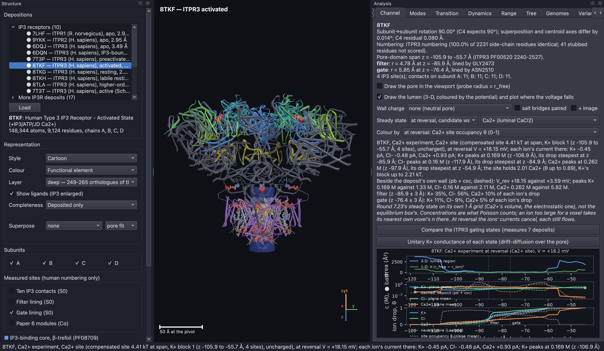

**Figure R9. At the crossing depth the site is about half full.** The lumen
of 8TKF is coloured by the site's occupancy θ, the fraction of time a site
holds a calcium ion, during Vais's calcium experiment. The site holds 2.0
calcium ions in total, with θ up to 0.89. Potassium's voltage drop is
steepest inside the occupied band. Calcium's is steepest at the band's
cytosolic edge, where it leaves the site.

### The site predicts how selectivity should change with luminal calcium.

`python -m ip3r molefrac` sweeps luminal CaCl₂ from 0.1 to 100 mM through the
crossing site. P_Ca:P_K peaks near Vais's 10 mM (15.1) and falls on either
side (8TKF / 7T3T: 11.8 / 12.5 at 1 mM, 9.0 / 12.0 at 100 mM). Without the
block it falls steadily. The potassium current at −40 mV halves at 6 mM
(8TKF) and 16 mM (7T3T) luminal calcium. These curves are predictions an
experiment could test. The site's calcium current at 0 mV (0.28 pA/mM) lands
near the measured 0.30, but only because the pore's potassium conductance is
7–9 times too low. Relative to its own conductance the model obeys the
independence principle (the Goldman–Hodgkin–Katz relation), which the real
channel does not. Restricted to the filter, the gate, the region between
them or the vestibule, the site never reaches 15.2, so the block has to cover
the whole span.

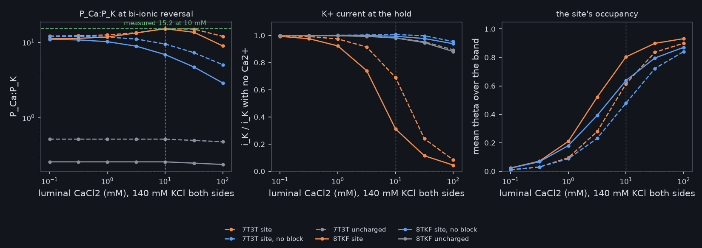

**Figure R10. The blocking site predicts a peak in selectivity and a fall in
potassium current as luminal calcium rises.** All three panels share a
horizontal axis of luminal CaCl₂ (log scale) with 140 mM KCl on both sides;
the dotted vertical line is Vais's 10 mM. Orange lines are the blocking site
and blue lines the same site without the block. Solid lines are 8TKF, dashed
lines 7T3T and grey lines the uncharged pore. Left: P_Ca:P_K peaks at the
measured 15.2 near 10 mM only with the block. Middle: the potassium current,
relative to its calcium-free value, collapses only when the site blocks.
Right: the site's mean occupancy rises from near zero to about 0.9 over the
range.

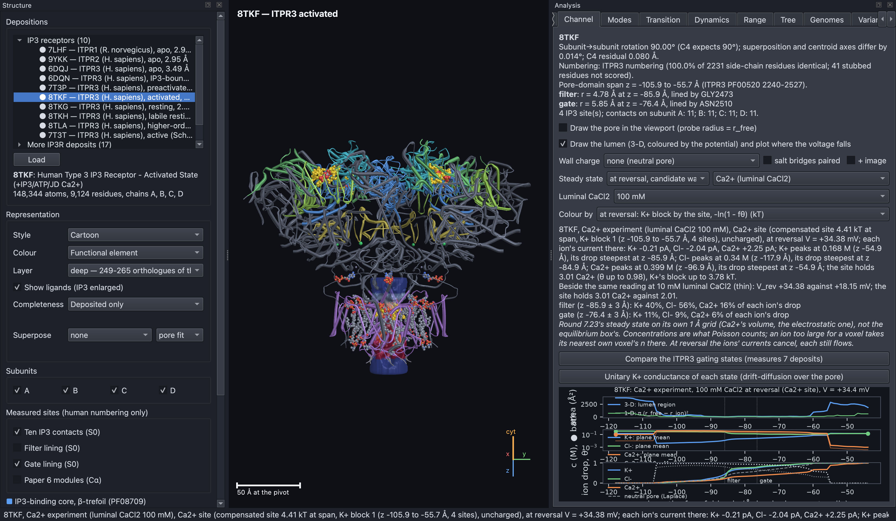

**Figure R11. At higher luminal calcium the site fills in place.** The same
8TKF site is drawn at 100 mM luminal CaCl₂, coloured by the energy with which
it blocks potassium, with the 10 mM reading plotted beside it. The site holds
0.5, 2.0 and 3.0 calcium ions at 1, 10 and 100 mM, and potassium's block rises
from 0.3 to 3.8 kT. Each ion's resistance stays where it was, so the site
fills without moving.

## The ryanodine receptor tests the same pore models on a better-measured channel.

### RyR1's structures are measured in the same way as the IP3 receptor's.

Rabbit RyR1 is loaded beside the IP3 receptors. Six structures were chosen
from the PDB by stated rules (`scripts/curate_ryr.py`: full length, wild
type, activators only, 4 Å resolution or better, the best per state). There
is one each for the closed, primed, open, inactivated and closed-inactivated
states, plus a primed structure from the open state's own paper for the
morph (9R8O to 9HEO). The shut states all close at isoleucine I4937, and only
open 9HEO widens (5.05 Å). Its modelled potassium conductance is 136 pS
uncharged and 180 pS charged, against 801 pS measured.

RyR1 also allows a stronger test than a single number, because five mutants
that remove a charge have been measured (`python -m ip3r mutants`). The model
gets the direction right for all four residues that line the pore, and
correctly predicts no effect for E4955Q, which does not. It misses the
largest effect. D4899Q cuts conductance to 0.20 times, but the model
predicts 0.90. D4899, like ITPR3's matching D2478, is in a salt bridge, so
cancelling the pair predicts no effect at all.

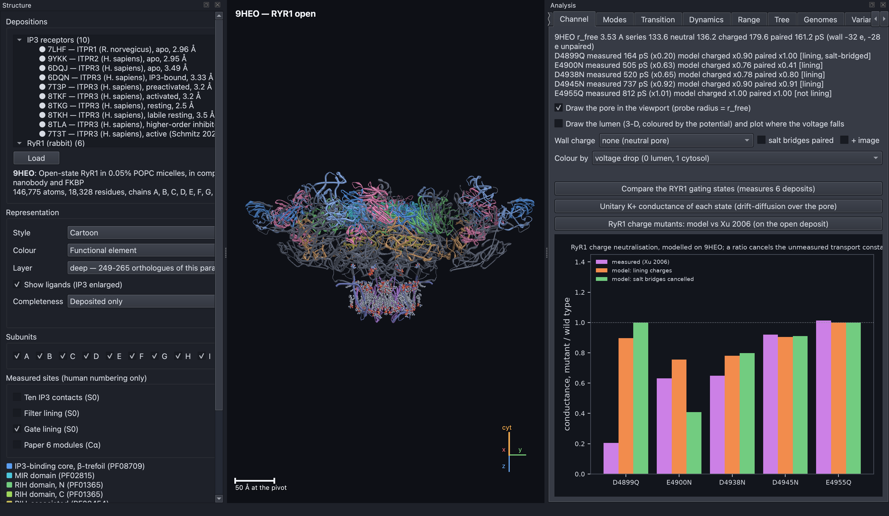

**Figure R12. The model reproduces four of RyR1's five charge mutants but
misses the largest.** Each group of bars is one mutant's conductance
relative to the normal channel. Violet is Xu et al. (2006)'s measurement,
orange is the model with the lining charges, and green is the model with
salt bridges cancelled. The model tracks E4900N, D4938N, D4945N and E4955Q
reasonably well. For D4899Q (left) the measurement falls to 0.20, while the
model barely moves.
