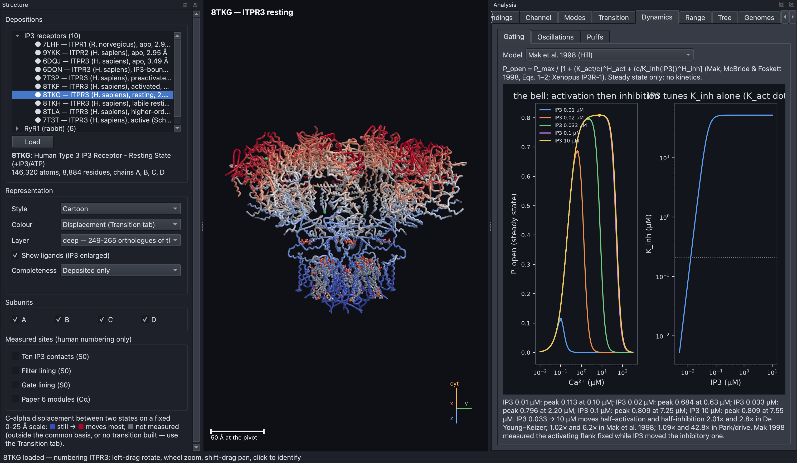
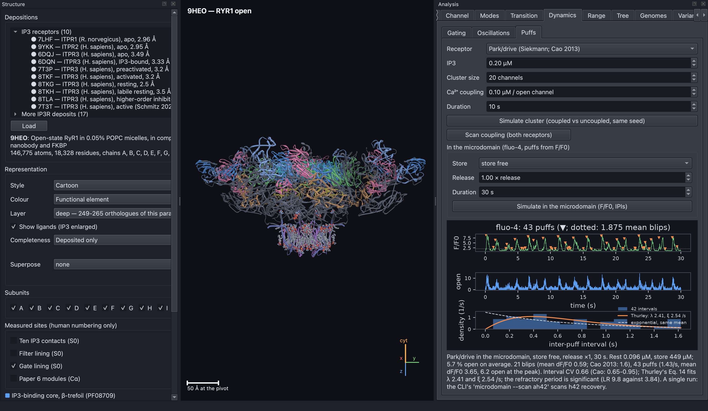
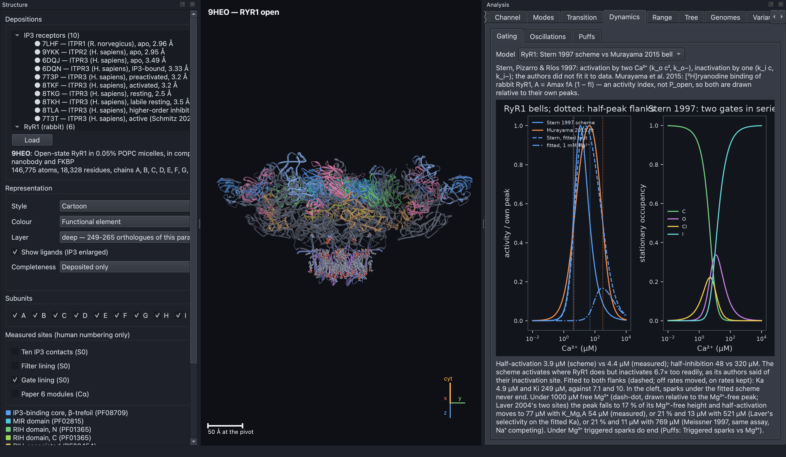
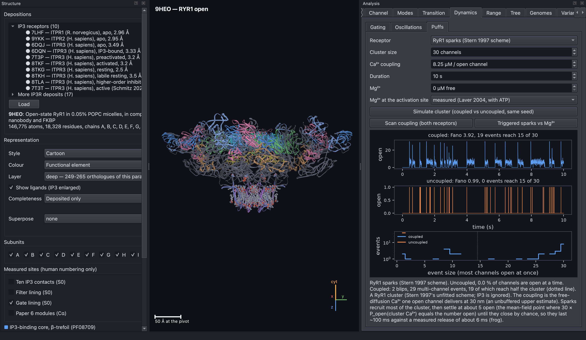
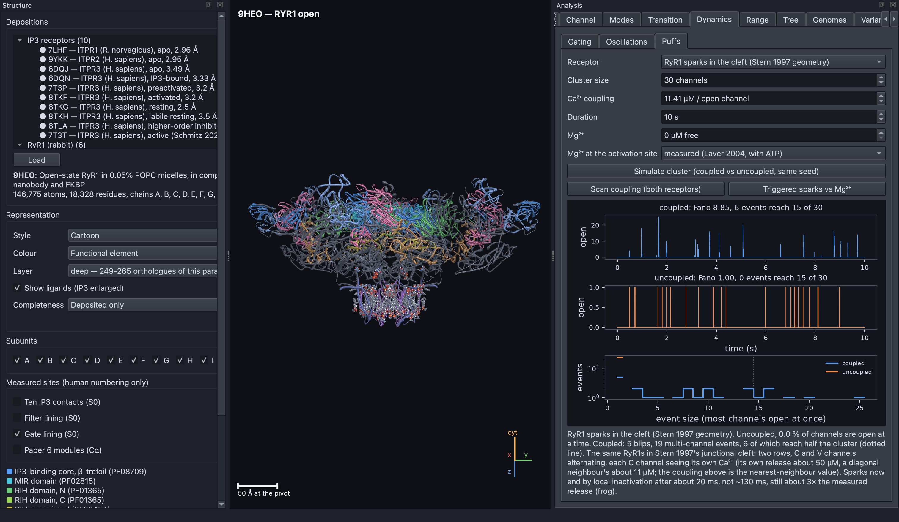
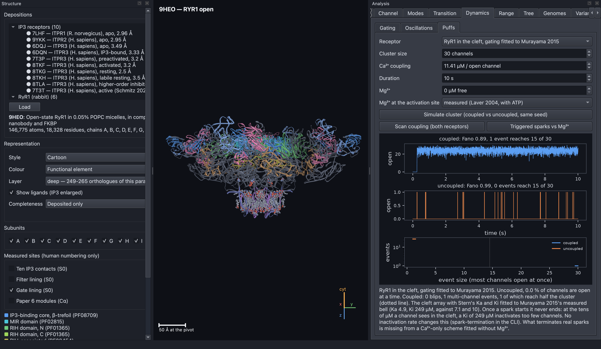
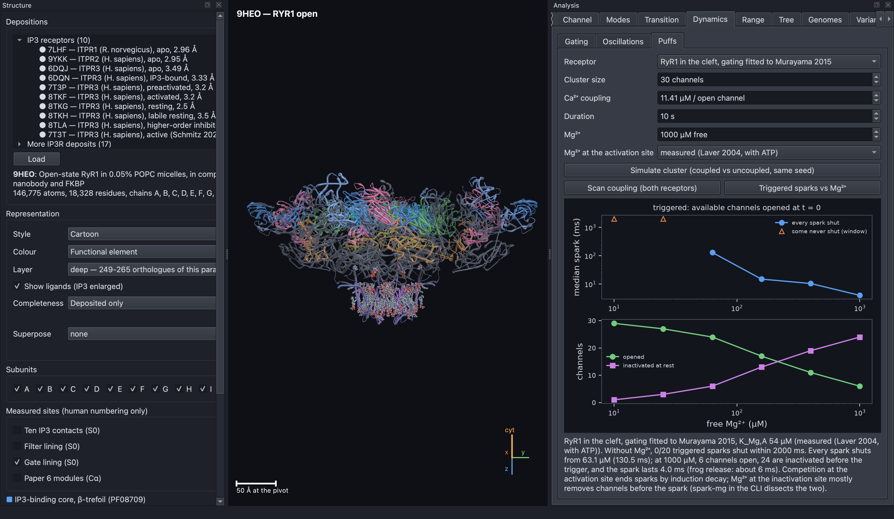

# Results of the gating, puff and spark models

This document explains, in plain language, what the simulator's models of
channel gating and clustered calcium release have found. It covers the IP3
receptor's gating models and puffs, and the ryanodine receptor's sparks and
voltage-controlled release. The [README](../README.md) gives the background,
and [`RESULTS.md`](RESULTS.md) covers ion permeation and selectivity. The
equations and sources are in [`SCIENCE.md`](SCIENCE.md),
[`SCIENCE_PUFF_DOMAIN.md`](SCIENCE_PUFF_DOMAIN.md),
[`SCIENCE_RYR.md`](SCIENCE_RYR.md) and [`SCIENCE_EC.md`](SCIENCE_EC.md).

## A few terms are used throughout this document.

- **Open probability** is the fraction of time a channel is open. Plotted
  against cytosolic calcium it forms a **bell**: low calcium activates the
  channel and high calcium inhibits it.
- **Half-activation** and **half-inhibition** are the calcium levels at which
  the bell reaches half its peak on its rising and falling sides.
- A **puff** (IP3 receptors) or **spark** (ryanodine receptors) is a burst of
  release in which several channels of one cluster open together, because
  calcium from one open channel activates its neighbours (**coupling**).
- The **Fano factor** measures how bunched openings are. A value near 1 means
  channels open independently, and a larger value means they open together.

## The IP3 receptor gating and puff models reproduce measured behaviour.

The De Young–Keizer model moves both sides of its bell as IP3 rises. The
Mak, McBride and Foskett (1998) model, fitted to single IP3R-1 channels,
lets IP3 tune only calcium inhibition. From 33 nM to 10 µM IP3 it moves the
half-inhibition point 6.2 times and half-activation only 1.016 times, as the
measurements show. De Young–Keizer moves them 2.8 and 2.0 times, and the
park/drive model 43 and 1.09 times (`python -m ip3r gating --model mak`).

**Figure D1. In the Mak model, IP3 relieves calcium inhibition without
changing activation.** The left plot shows the steady-state open probability
against cytosolic calcium (log scale) at five IP3 concentrations from 0.01 to
10 µM. At the lowest IP3 the bell is small and narrow, because calcium shuts
the channel almost as soon as it activates it. As IP3 rises, the right-hand
(inhibitory) side of the bell moves to higher calcium and the peak grows,
while the left-hand (activating) side stays in place. The right plot shows
why: IP3 raises only the inhibition constant K_inh, which levels off above
about 0.1 µM IP3.

`python -m ip3r microdomain` places the park/drive cluster in Cao et al.
(2014)'s microdomain, in which calcium pools fill and drain, the fluorescent
dye fluo-4 reports calcium, and the store can empty (see
`SCIENCE_PUFF_DOMAIN.md`). Puffs are then read from the fluorescence
signal, as in an experiment. As the recovery rate from inhibition rises from
0.1 to 5 per second, the puff rate rises 5.5 times and the variability of the
intervals between puffs approaches that of a random process, as in Cao 2013.
Fluorescence amplitude levels off at about 12 receptors while calcium levels
off less, because the dye saturates. The model's sustained 9 % open state
survives the microdomain, and emptying the store makes the cluster more
active, not less, so that state belongs to the receptor model itself.

**Figure D2. Puffs read from simulated fluorescence behave like measured
puffs.** A park/drive cluster is simulated in Cao's microdomain. The top trace
is the fluorescence relative to rest (F/F0), with detected puffs marked. The
middle trace is the number of open channels. The histogram compares the
intervals between puffs with Thurley's refractory model (which predicts few
very short intervals) and with an exponential of the same mean (a purely
random process).

## The ryanodine receptor spark models show what ends a spark.

### A calcium-only gating scheme cannot end a calcium spark.

In the Dynamics → Gating panel, "RyR1" draws Stern et al. (1997)'s two-gate
scheme against Murayama et al. (2015)'s measured calcium response. The
scheme activates where RyR1 does (half-activation 3.9 against 4.4 µM), but
it shuts 6.7 times too readily (half-inhibition 48 against 320 µM).

**Figure D3. Stern's scheme activates correctly but inactivates too
early.** The left plot shows RyR1 activity against cytosolic calcium, each
curve scaled to its own peak. The blue line is Stern's 1997 scheme and the
orange line Murayama's measured response. The dashed blue line is the scheme
refitted to both sides of the measurement. The dash-dot line is that fit
under 1 mM free magnesium, whose peak falls and shifts right. The right plot
shows how Stern's four states (closed, open, closed-inactivated and
inactivated) share the channels at each calcium level.

The Puffs panel runs a 30-channel RyR1 cluster in which each open channel
raises the calcium its neighbours see. Uncoupled, it gives only single
openings. Coupled, it gives 1.5 sparks per second that recruit nearly the
whole cluster. With one shared calcium level the sparks last about 120 ms,
against about 6 ms measured. Placing the channels in Stern's junctional cleft
(two rows in a 60 × 15 nm gap), where each channel sees its own calcium,
shortens them to about 20 ms. That is still three times too long, and no
change of geometry closes the gap. With the gating fitted to the measured
calcium response, which inactivates only weakly, a spark never ends at all.
So a calcium-only scheme lacks whatever ends a real spark.

**Figure D4. Calcium coupling turns single RyR1 openings into sparks.** A
30-channel cluster using Stern's scheme is run for 10 seconds with and
without coupling, using the same random numbers. In the coupled trace (blue)
19 events recruit at least half the cluster, then settle at about five open
channels until they close by chance, so each lasts around 100 ms. The
uncoupled trace (orange) shows only scattered single openings. The histogram
of event sizes shows the coupled cluster's large events at the right.

**Figure D5. In the junctional cleft, sparks end sooner because each channel
sees its own calcium.** The same cluster is placed in Stern's cleft geometry.
Sparks end by local inactivation after about 20 ms. This is shorter than with
one shared calcium level but still about three times the measured duration.

**Figure D6. With gating fitted to the measured calcium response, sparks
never end.** With inactivation as weak as the measured response requires, the
tens of micromolar calcium in the cleft cannot shut the array, and once a
spark starts it continues to the end of the simulation.

### Magnesium ends the spark.

Adding the muscle fibre's 1 mM free magnesium supplies the missing brake
(`python -m ip3r spark-mg`; in the app, Puffs → Mg²⁺ and "Triggered sparks vs
Mg²⁺"). Magnesium competes with calcium at the activation site and shuts
triggered sparks with no channel inactivated, because the array's positive
feedback falls below one. How fast depends on magnesium's affinity for the
site. Meissner et al. (1997) measured it in the same assay as the fitted
response. Carried into that assay's salt conditions, it gives about 770 µM
(range 345–1,600 µM). At that affinity the activation site alone ends a
triggered spark in 32 ms at best, against 6.3 ms measured. With magnesium also
at the inhibitory site, which keeps about 80 % of channels shut before any
trigger, sparks end in about 6 ms under every reading.

**Figure D7. More magnesium means shorter sparks and fewer available
channels.** All 30 channels in the cleft are opened at time zero and timed
until every one has shut, at free magnesium levels from 10 to 1,000 µM (log
scale). Top: the median spark duration. Below about 60 µM some sparks never
end within the simulated window (orange triangles). Above it every spark
ends, falling to about 4 ms at 1 mM. Bottom: the number of channels that open
(green) falls as the number held inactive before the trigger (violet) rises.

### The voltage-controlled release unit reproduces Stern's model but not the fitted one.

In skeletal muscle, half of the RyR1 channels (V channels) are opened
directly by voltage sensors in the surface membrane. The other half (C
channels) are opened by calcium. `python -m ip3r ec` simulates this whole
release unit using Ríos (1993)'s allosteric model with Stern's rates (see
`SCIENCE_EC.md`). With Stern's constants it reproduces his release under
voltage clamp: a peak, a plateau and a stop when the membrane repolarises.
With the C channels fitted to the measured calcium response, no magnesium
arrangement gives a peak: either release continues after repolarisation or
the C channels hardly open. Emptying the calcium store (`ec --depletion`)
restores a peak only by releasing more of the store than a muscle fibre
loses. A two-site inactivation gate fitted to the response's slope
(`ec --two-site`) makes it worse, because it inactivates less at cleft calcium
levels.
