# User guide for the IP3R Structural Simulator

This guide explains how to use the desktop app and the command line. The
[README](../README.md) explains what the project is and how to install it.
The same guidance is available inside the app under Help → Guide (**F1**).

## The window has three areas that can be rearranged.

The **Structure** panel on the left chooses which structure is shown and how
it is drawn. The **3-D view** in the centre shows the receptor. The
**Analysis** panel on the right holds the tabs: Findings, Channel, Modes,
Transition, Dynamics, Range, Tree, Genomes and Variants. Panels are movable
docks: drag them anywhere, float them or close them. View → Reset layout puts
them back. The app remembers the layout between runs.

The 3-D view carries a heads-up display (HUD): the structure's name, a scale
bar that is exact at the rotation centre, and an axis marker whose "cyt" arm
points to the cytosol. An amber line appears whenever AlphaFold predictions
are drawn, so predicted atoms are never mistaken for measured ones.

## The mouse and keyboard control the 3-D view.

| Mouse | Action |
|---|---|
| left-drag | rotate |
| shift-drag or middle-drag | pan |
| scroll wheel or right-drag | zoom |
| click | select a residue (the status line names it) |
| shift-click | add or remove a residue from the selection |
| right-click | a menu of actions for the residue under the cursor |

| Key | Action |
|---|---|
| Ctrl+1 | side view, cytosol up |
| Ctrl+2 | top view, looking down the pore |
| Ctrl+3 | one IP3 binding site: its 15 Å pocket, with the rest of the tetramer in front clipped away |
| Ctrl+0 | fit the visible subunits and resume automatic fitting |
| Ctrl+M | measure a distance: click two atoms |
| Ctrl+Shift+Q | open the sequence window |
| Ctrl+S | save a screenshot, including the HUD |
| Ctrl+Shift+S / Ctrl+O | save / open a session |
| Ctrl+Shift+P | open the parameter editor |
| F11 | full screen (Esc leaves) |
| Esc | clear the selection and stop measuring |
| F1 | the built-in guide |
| Space, R, O, + / − | spin, frame everything, switch orthographic / perspective, change atom size (with the 3-D view focused) |

Until you move the camera yourself, the view keeps the molecule filling the
window as the window is resized or subunits are hidden.

## You can select residues, measure distances and read the sequence.

A click selects a residue, drawn as gold spheres. The right-click menu can
select the same residue on every subunit, select a whole chain, centre the
view on an atom or start a distance measurement. View → Sequence shows each
chain's complete construct in the structure's own numbering. Residues that
were not resolved in the map are dimmed. The sequence can be tracked by
chemistry, functional element, conservation or resolution, with the key
sites underlined. Dragging across the sequence selects those residues on the
model.

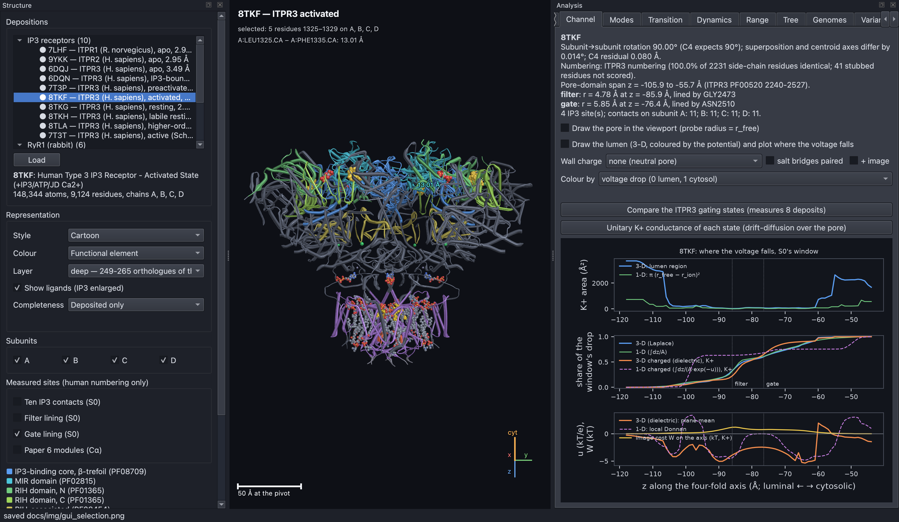

**Figure U1. A selection is shown on the model and in the sequence at the same
time.** Residues selected in the sequence window appear as gold spheres on
8TKF, and a measured distance is drawn as a rod labelled in ångströms. The
sequence window lists the whole construct; unresolved residues are dimmed.

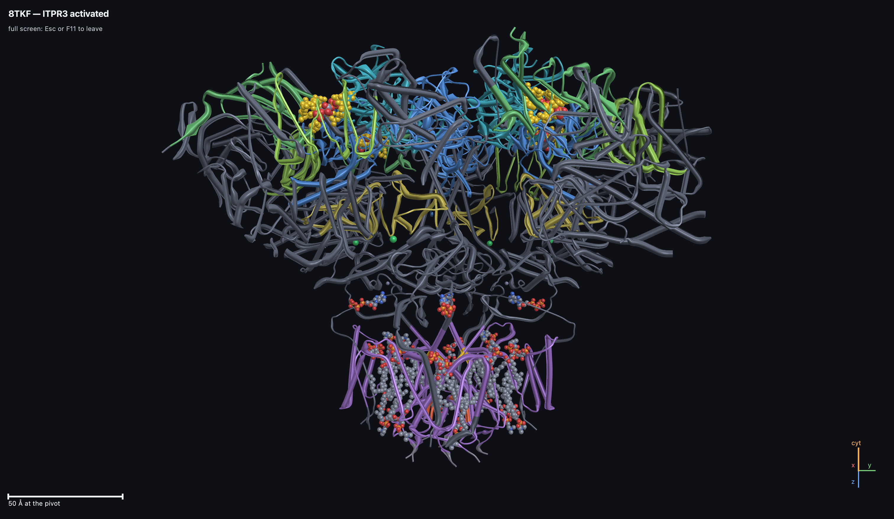

**Figure U2. Full-screen mode keeps only the 3-D view and its HUD.** F11
hides every panel, menu and status bar. Esc returns each panel to where it
was.

## The Structure panel chooses what is drawn.

### The structure list is grouped by receptor family.

The list has three groups. **IP3 receptors** holds the nine structures the
publication uses plus the 7T3T control. **More IP3R deposits** holds 17
further full-length structures of human ITPRs and rat ITPR1, chosen by
stated rules (`scripts/curate_ip3r.py`). They can be viewed, measured,
superposed and morphed, but no check uses them. **RyR1** holds the six
ryanodine receptor structures. Choose a style (cartoon, tube, spheres or
sticks), a colouring, and which subunits to show. The "Measured sites" boxes
highlight the IP3 contacts, the filter and gate lining and the Paper 6
modules. They are drawn only on a structure in human numbering.

### Superposing draws a second state on top of the first.

Representation → Superpose draws another structure of the same paralog in
orange, fitted on the pore domain or globally. Every atom of the second
structure is moved by the fit, so its side chains and IP3 are its own. Its
subunits are relabelled to match, so hiding a subunit hides both copies.

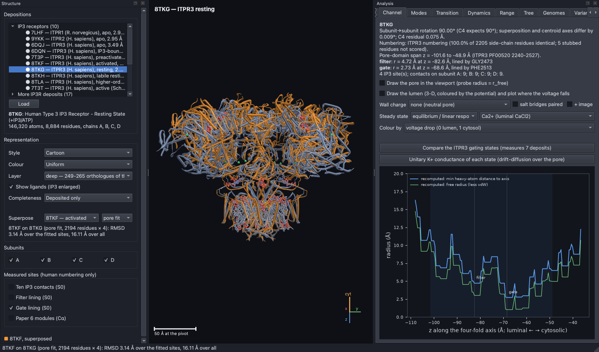

**Figure U3. Superposing the open state on the resting state shows the
cytosolic cap swinging while the membrane stays put.** Activated 8TKF
(orange) is fitted on resting 8TKG using the pore domain. The fit is 3.14 Å
over the pore but 16.11 Å overall, because the large cytosolic domains move
while the membrane region hardly changes.

### AlphaFold can fill what the map leaves out, but only as a prediction.

Representation → Completeness adds AlphaFold's predicted residues where a
structure has none. "+ AlphaFold gaps" fills internal gaps, each fitted on
resolved residues on both sides. "+ gaps and ends" also adds the two ends.
Filled residues are always drawn in AlphaFold's own confidence (pLDDT)
colours. Each join is drawn as a bond, pale where it closes and red where it
does not. Every measurement still runs on the deposited structure only.

The simulator chooses the prediction by checking which one matches the
structure's numbering, or failing that, which one is the same protein by
sequence alignment. So rat 7LHF is filled from rat ITPR1 isoform 8, and ITPR2's
9YKK has no model and is refused with a reason. On 8TKG, 1,592 residues are
filled at a mean confidence of 38. Tested on 16 stretches that 8TKG resolves
but another structure does not, fills land a median 1.1 Å from the truth,
against 5.5 Å for a straight line. Confidence matters more than length: the
one resolved stretch below pLDDT 50 was placed 58 Å off. The summary therefore
counts residues below pLDDT 50 and says they are not positions
(`python -m ip3r graft 8TKG --calibrate`).

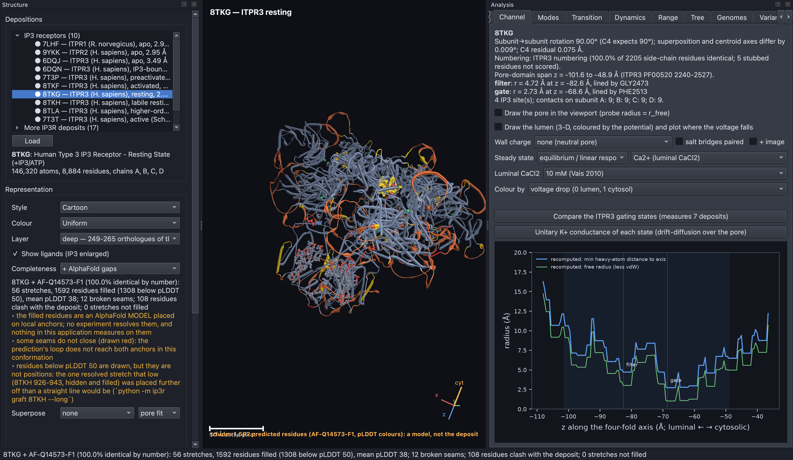

**Figure U4. AlphaFold fills are drawn in confidence colours, with their
joins marked.** The deposited structure is drawn as usual and the predicted
residues in AlphaFold's pLDDT colours, from blue (confident) through yellow
to orange (very uncertain). Most fills are low-confidence loops, because AlphaFold is least sure
exactly where the cryo-EM map is empty. An amber line in the HUD warns that
predicted atoms are on screen.

## Each analysis tab answers one kind of question.

### The Findings tab re-derives the publication's results.

"Run all checks" runs the 52 checks against `ip3r_genes` (this needs a copy
of that project; see the README). Selecting a check shows its claim, method,
sources, verdict and a plot. "Show on structure" draws residue-based findings
on the current structure, or opens the tab that displays them. If any
parameter differs from its default, checks report *not run* instead of
confirming.

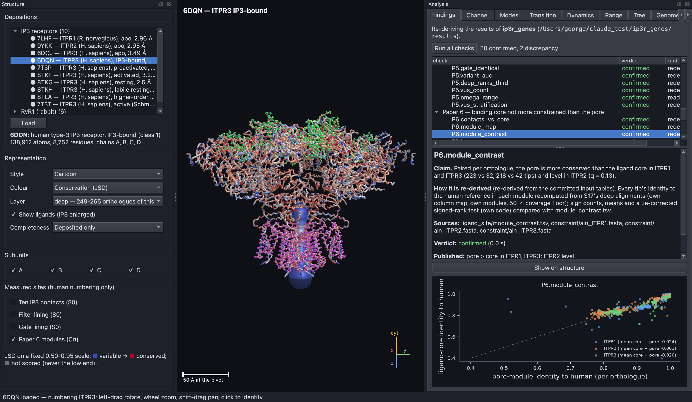

**Figure U5. Paper 6's two modules are drawn as backbone traces.** The ligand
core is green and the pore module (without its luminal loop) is magenta, on
6DQN.

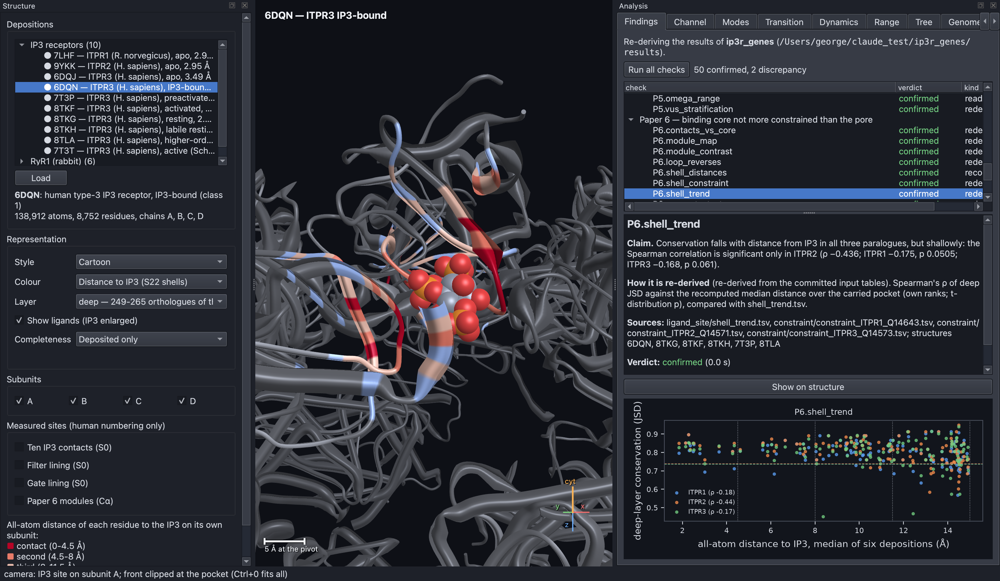

**Figure U6. Colouring by distance to IP3 shows the ligand's four shells.**
Every residue is coloured by its distance to the IP3 bound on its own subunit,
in four shells: contact (under 4.5 Å), then 8, 11.5 and 15 Å. Residues
further away, and subunits without IP3, are grey. The plot shows conservation
against distance for all three paralogs.


**Figure U7. One IP3 contact depends on whether hydrogens are counted.** This
check's plot shows each contact's distance to IP3 with and without hydrogen
atoms. Arg503 is within the 4.5 Å contact cut-off only when hydrogens are
included (4.78 and 4.83 Å without them, in 8TKG and 8TKH). The publication
now states this, after the simulator reported it.

### The Channel tab measures the pore and models ions passing through it.

The Channel tab shows the axis, numbering, pore profile, filter, gate and IP3
contacts of the current structure. It can draw the pore, compare all states
of the family and predict each state's conductance. "Draw the lumen" solves
the open pore in 3-D and colours its surface. The lumen box offers:

- **Wall charge**: none, or one of four ways of placing the wall's charges
  (slice, local, Poisson–Boltzmann, or dielectric with the protein included),
  with or without the salt bridges paired, and "+ image" for the image force;
- **Steady state**: equilibrium, the experiment at its reversal potential, or
  one of the candidate walls from the selectivity search;
- **Luminal CaCl₂**: the calcium level in the calcium experiment;
- **Colour by**: voltage drop, wall potential, K⁺ energy, image energy, each
  ion's concentration or drop, or a calcium site's occupancy or block.

The first dielectric or image solve can take a few minutes; results are cached
in `data/cache/`. The science behind each option, with figures, is in
[`RESULTS.md`](RESULTS.md).

### The Modes and Transition tabs show how the receptor moves.

The Modes tab computes the elastic network's normal modes, labels each by
symmetry (A, B or E) and by how many residues take part, and animates any mode.
The Transition tab morphs between two states of one paralog, colours residues
by how far they move, plots the gate along the path, and compares the
movement with the normal modes (Figure 4 of the README).

### The Dynamics tab runs the gating, oscillation and puff models.

Gating draws the bell-shaped response of each gating model, or the RyR1
models when a RyR1 structure is loaded. Oscillations runs whole-cell calcium
oscillations. Puffs simulates a cluster of receptors with and without
calcium coupling, and for park/drive receptors can run the fluorescent
microdomain. For RyR1 it offers sparks, the junctional cleft and magnesium.
The results are described in [`RESULTS_DYNAMICS.md`](RESULTS_DYNAMICS.md).

### The Tree tab draws the receptor family's evolutionary tree.

The Tree tab draws Paper 2's maximum-likelihood tree of 134 proteins, rooted
on the ryanodine receptors. "Vertebrates" zooms to the 57 vertebrate tips.
"Beside --bnni" draws a re-analysis that guards against model violations next
to it and lists what happened to each clade claim: 9 of 10 held.

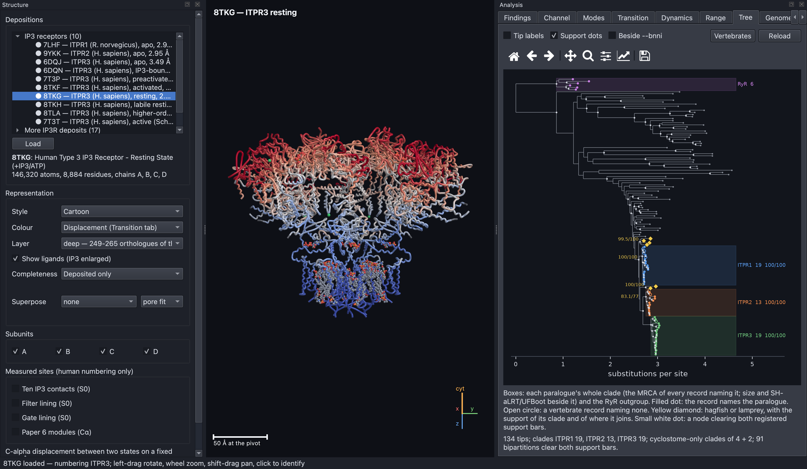

**Figure U8. Each paralog forms its own well-supported clade.** The tree is
drawn with branch length in substitutions per site. Coloured boxes mark the
ITPR1 (19 proteins), ITPR2 (13) and ITPR3 (19) clades and the RyR outgroup,
each with its size and support values. Yellow diamonds mark hagfish and
lamprey proteins, labelled with the support of their clade and of where it
joins. Small white dots mark nodes that clear both support thresholds (80 and
95).

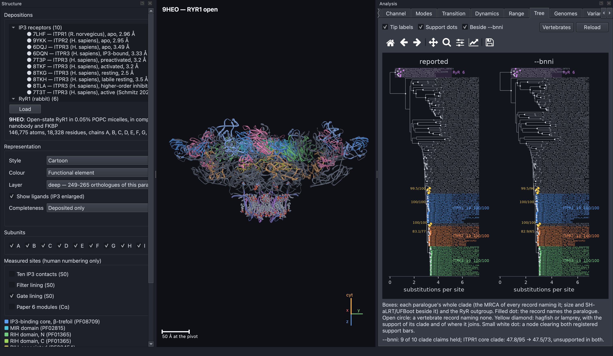

**Figure U9. The published tree and the model-violation re-search agree on
nearly every claim.** The two trees are drawn side by side. The only change
is the ITPR1 core, which was never well supported: its support falls from
47.8/95 to 47.5/73.

### The Genomes tab shows which genes were found in each genome.

The Genomes tab draws Papers 3 and 4 as a grid, with a row for each of 309
genome assemblies and a column for each gene. The cells can be coloured by
what the search found, by known genes it missed, by evidence state, by how a
protein search could reach the gene, or by damaging mutations (lesions).
Rows can be sorted by assembly quality (contig N50), class or name.

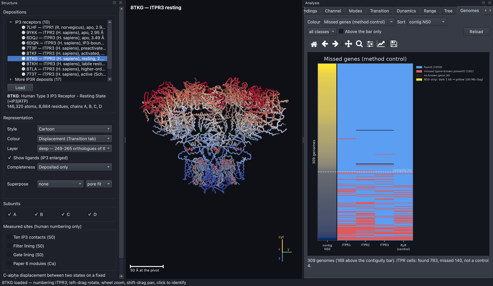

**Figure U10. Missed genes cluster in poorly assembled genomes.** Each row is
a genome, sorted by contig N50 (a measure of assembly quality; the strip on
the left runs from dark for poor to yellow for good, on a log scale). Blue
cells are genes found and red cells are genes known to be present but
missed. Almost all misses fall below the dashed contiguity threshold, showing
that they reflect assembly quality rather than real gene loss.

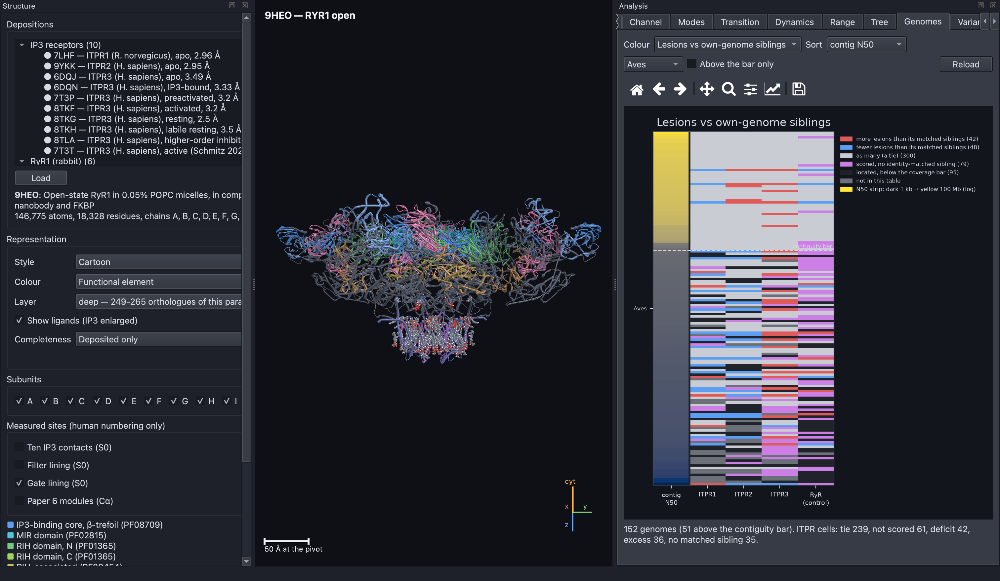

**Figure U11. Bird ITPR3 genes carry more damaging mutations than their
genome's other genes.** The grid is coloured by whether each gene carries
more frameshifts and stop codons than similar genes in the same genome, and
filtered to birds. ITPR3's excess (25 genomes against 2) sits mostly in
assemblies below the contiguity threshold.

### The Range tab shows where in the tree of life the receptor is found.

The Range tab draws Paper 1 as one bar per clade of the 6,928-proteome survey:
the fraction of proteomes carrying an IP3 receptor, on a fixed 0–1 scale,
coloured by supergroup. A red cross marks a clade whose absence held up in
controlled genome assemblies. Double-clicking a clade lists its genomes one by
one.

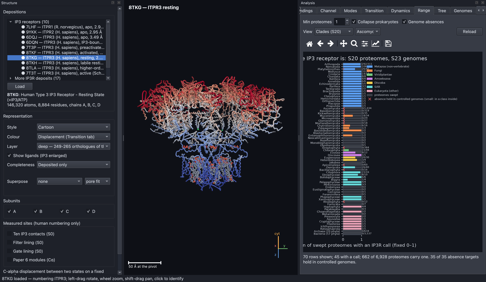

**Figure U12. The receptor is found across eukaryotes but lost repeatedly.**
Each bar is one clade, showing the fraction of its proteomes that carry an
IP3 receptor. Colours mark eukaryotic supergroups, and archaea and bacteria
are collapsed to one row each. Red crosses mark absences confirmed in
genome assemblies.

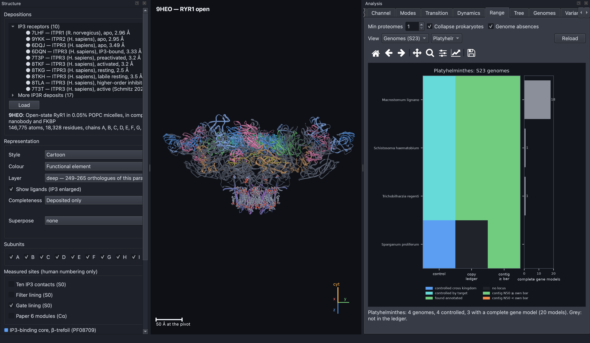

**Figure U13. A clade's genomes are shown one by one.** For each genome the
cells show the control verdict, what the copy ledger found, whether the
assembly reaches its own contiguity threshold, and how many complete gene
models it has (on a fixed 0–20 scale).

### The Variants tab places human variants on the structure.

The Variants tab lists the human variants for one paralog and class.
"Draw on structure" puts a sphere on each variant residue: harmful
(pathogenic or likely pathogenic, P/LP) red, harmless (benign, B/LB) blue,
conflicting violet, and VUS amber. "VUS by layer" places each VUS against its
gene's P/LP and B/LB medians on one conservation layer, as in Paper 5. This
is a grouping, not a diagnosis.

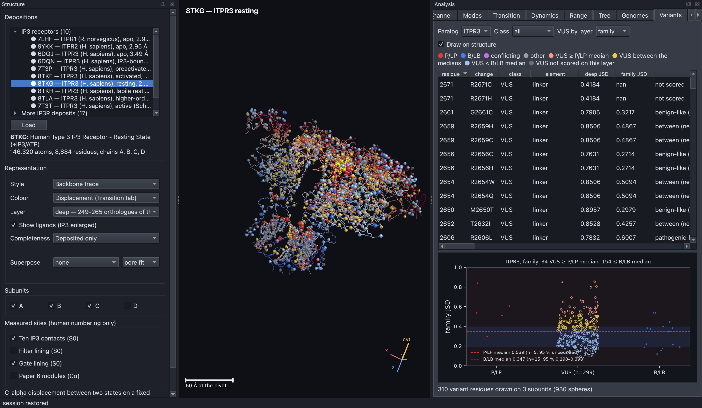

**Figure U14. Variants are drawn on every visible subunit.** Each variant
residue of the chosen class is marked with a sphere on the structure, and
the table lists each variant's change, class, element and conservation.

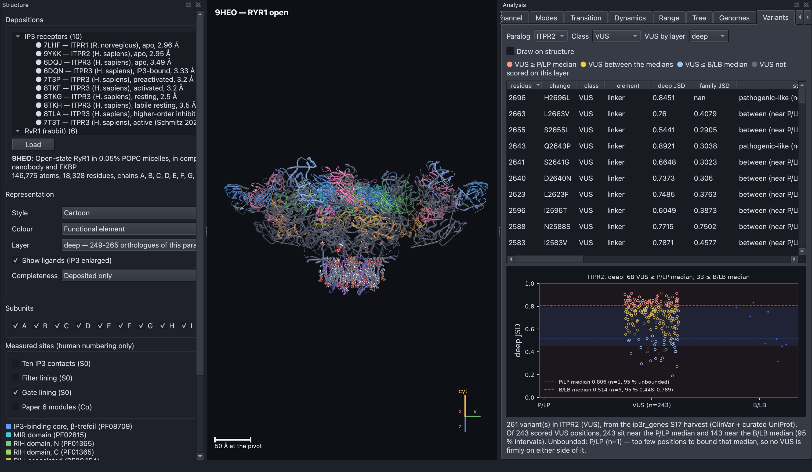

**Figure U15. With too few harmful variants, a threshold cannot be trusted.**
ITPR2's VUS (centre column) are plotted by conservation, beside the known
harmful (left) and harmless (right) variants. Dashed lines mark the two
medians and the shaded bands their 95 % intervals. ITPR2 has only one P/LP
position, so its median cannot be bounded and no VUS counts as firmly
pathogenic-like. Hollow points are VUS that a threshold within the interval
could move.

## The Analyses menu runs command-line analyses in their own window.

The Analyses menu lists the command-line analyses by group (Structure,
Permeation, Gating and puffs, Findings), each with an estimate of how long it
takes. Each opens a window where the command can be edited, run, stopped and
saved. The window is stamped with the structure on screen and whether the
parameters are the defaults. Any edited parameters are passed to the command.

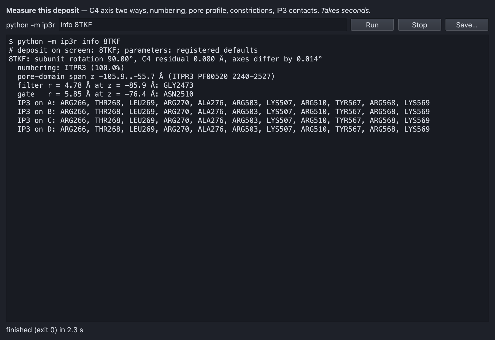

**Figure U16. An analysis window runs one command and records its context.**
"Measure this deposit" runs `python -m ip3r info 8TKF`. The output lists the
symmetry, numbering, pore span, filter and gate radii with the residues that
line them, and the eleven IP3 contacts on each subunit. The second line
records the structure on screen and the parameter set used.

## Parameters can be edited, exported and replayed.

Help → Parameters (**Ctrl+Shift+P**) lists every registered number with its
default, bounds, unit and source. Double-click a value to change it. Values
outside the bounds are clamped, and the clamp is reported. While anything
differs from its default, an amber banner runs across the window and the
findings checks report *not run*. Edits are not remembered after you quit.
"Export…" writes the set as JSON, and
`IP3R_PARAMETERS=file.json python -m ip3r …` replays it from the command line.

Controls whose starting value is a parameter (the puff cluster size and
coupling, and the microdomain run length) follow an edit unless you have
typed your own value. Plots that were not explicitly requested are redrawn.
Results you ran yourself keep the values they were computed with until you
run them again.

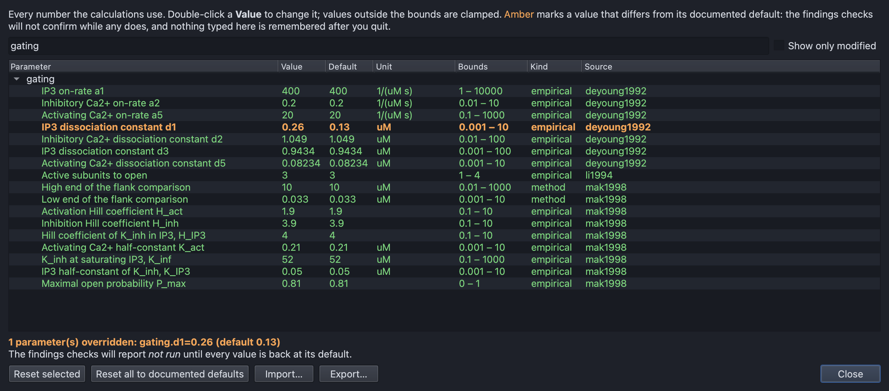

**Figure U17. The parameter editor lists every number with its source.**
Each row shows a parameter's key, value, unit, bounds and citation. The filter
box finds parameters by name, and "modified only" shows what has been
changed.

## Sessions save the view but never the results.

File → Save session (**Ctrl+Shift+S**) writes the current view as JSON:
the structure, style, colouring, subunits, highlighted sites, pore, camera,
open tab, any transition built, the animated mode, the Dynamics and Variants
settings, and the parameter overrides in force. File → Open session
(**Ctrl+O**) or `python -m ip3r --session file.json` restores it. A session
holds no coordinates and no results; everything is recomputed from the same
inputs. If the saved parameters differ from the current ones, you are asked
which to use.

## Every command-line analysis is listed here by topic.

Most commands take one or more PDB codes, and `--help` lists their options.
Commands that need a structure not yet downloaded accept `--fetch`.

**Structures and motion**

```bash
python -m ip3r fetch [PDB ...]                # download structures and AlphaFold models
python -m ip3r info 8TKF                      # measure one structure
python -m ip3r states [--extended] [--paralog RYR1]   # pore radius of every state
python -m ip3r modes 6DQN                     # normal modes with symmetry labels
python -m ip3r transition 8TKG 8TKF [--gate] [--cutoff-scan] [--stride-check]
python -m ip3r graft 8TKG [--calibrate] [--long]      # AlphaFold fills and their accuracy
```

**Conductance and where the voltage falls**

```bash
python -m ip3r unitary                        # K+ conductance of each state
python -m ip3r shortfall [--scan]             # open pores in 1-D and 3-D against the measurements
python -m ip3r lumen [PDB ...] [--charge CLOSURE [--paired] [--image]]
python -m ip3r wall3d [--scan] [--mutants]    # the lining charges in 3-D
python -m ip3r bridge [PDB] [--scan] [--mutants]      # the filter's salt bridge
python -m ip3r born [PDB] [--scan] [--mutants]        # the image force
```

**Selectivity**

```bash
python -m ip3r selectivity [--closure donnan|radial]  # Vais 2010's ratios through 8TKF
python -m ip3r protonation [PDB] [--corners]  # lining pKas and selectivity under each
python -m ip3r csc [PDB] [--scan]             # ion size and crowding
python -m ip3r sel3d [PDB] [--mutants]        # selectivity in the 3-D lumen
python -m ip3r gate [PDB ...] [--delta D]     # the gate widened
python -m ip3r reversal [PDB ...] [--mutants] [--scale F] [--lumen]   # the reversal experiment in 3-D
python -m ip3r wallsearch [PDB ...]           # the search over wall models
python -m ip3r casite [PDB ...]               # a calcium site that blocks potassium
python -m ip3r molefrac [PDB ...]             # the mole-fraction prediction
```

**Gating, oscillations and puffs**

```bash
python -m ip3r gating [--model dyk|mak|pd]    # the bell-shaped response
python -m ip3r oscillate [--window]           # whole-cell oscillations
python -m ip3r puffs [--ip3 0.2] [--model park-drive] [--scan]
python -m ip3r microdomain [--scan ah42|n|store]      # puffs read from fluorescence
```

**Ryanodine receptor**

```bash
python -m ip3r mutants                        # charge mutants against Xu 2006
python -m ip3r ryr-gating                     # gating schemes against the measured bell
python -m ip3r sparks [--scan] [--cleft [--fit]]
python -m ip3r spark-termination --scan fit|ki|rate|use|ratio|fraction|low-activity|speed
python -m ip3r spark-mg [--scan] [--reading measured|selectivity|meissner]
python -m ip3r ec [--scan] [--two-site] [--use] [--depletion [--pool-scan]]
```

**Publication checks and parameters**

```bash
python -m ip3r checks [--paper constraint] [--figures out/]
python -m ip3r params                         # every parameter with its source
```

## Environment variables change where data are found.

| Variable | Effect |
|---|---|
| `IP3R_GENES_DIR` | location of the `ip3r_genes` project (default `../ip3r_genes`) |
| `IP3R_STRUCTURE_MIRROR` | a folder of structure files to copy from instead of downloading |
| `IP3R_PARAMETERS` | a JSON file of parameter overrides, as written by the editor's Export |

## Common problems have simple fixes.

- **"Structure unavailable"**: run `make fetch`, or add `--fetch` to the
  command. The app downloads missing structures on its own.
- **Findings report "not run"**: either `ip3r_genes` was not found (clone it
  beside this repository or set `IP3R_GENES_DIR`) or a parameter has been
  changed (reset it in the parameter editor).
- **The app does not start or the 3-D view is blank**: the viewer needs
  OpenGL 4.1. The command-line analyses work without it.
- **A lumen view takes minutes**: the dielectric closure and the image force
  are slow the first time. Their results are cached in `data/cache/`.
